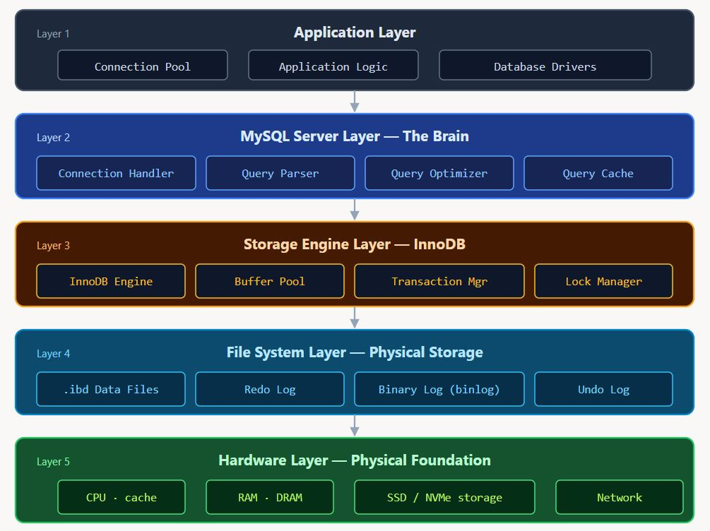
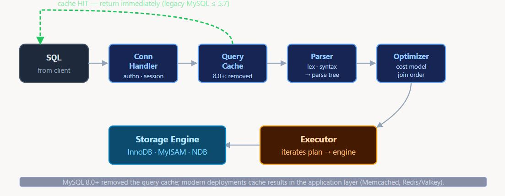

# Lection 2

## Thema "MySQL database management system"

1. ### Introduction

&nbsp;&nbsp;&nbsp;&nbsp;&nbsp;MySQL is a free and open-source relational database management system (RDBMS). Its name is a combination of "My", the name of co-founder Michael Widenius' daughter My, and "SQL", the acronym for Structured Query Language. A relational database organizes data into one or more data tables in which data may be related to each other; these relations help structure the data. SQL is a language that programmers use to create, modify and extract data from the relational database, as well as control user access to the database. In addition to relational databases and SQL, an RDBMS like MySQL works with an operating system to implement a relational database in a computer's storage system, manages users, allows for network access and facilitates testing database integrity and creation of backups.

&nbsp;&nbsp;&nbsp;&nbsp;&nbsp;MySQL is free and open-source software under the terms of the GNU General Public License, and is also available under a variety of proprietary licenses. MySQL was owned and sponsored by the Swedish company MySQL AB, which was bought by Sun Microsystems (now Oracle Corporation). In 2010, when Oracle acquired Sun, Widenius forked the open-source MySQL project to create MariaDB.

&nbsp;&nbsp;&nbsp;&nbsp;&nbsp;MySQL has stand-alone clients that allow users to interact directly with a MySQL database using SQL, but more often, MySQL is used with other programs to implement applications that need relational database capability. MySQL is a component of the LAMP web application software stack (and others), which is an acronym for Linux, Apache, MySQL, Perl/PHP/Python. MySQL is used by many database-driven web applications, including Drupal, Joomla, phpBB, and WordPress.[11] MySQL is also used by many popular websites, including Facebook, Flickr, MediaWiki, Twitter,and YouTube.

2. ### MySQL Architecture Overview

**Complete MySQL Architecture Flow**



_MySQL's five logical layers. A query enters at Layer 1 and traverses down to Layer 5 (hardware); results flow back up the same path._

#### 2.1. Application Layer - The Entry Point

!_**works at client\'s side.**_

&nbsp;&nbsp;&nbsp;&nbsp;&nbsp; Every MySQL query begins its journey at the application layer, where your business logic interfaces with the database. This layer is responsible for establishing connections, managing connection pools, and sending SQL statements to the MySQL server.

##### Connection Pool Management

&nbsp;&nbsp;&nbsp;&nbsp;&nbsp;The connection pool is arguably one of the most critical components for database performance. Creating and destroying database connections is expensive, involving TCP handshakes, authentication, and resource allocation. Connection pooling solves this by maintaining a reservoir of pre-established connections that can be reused across multiple requests.

Connection Pool Benefits:

- Reduced Latency: Eliminates connection establishment overhead
- Resource Efficiency: Limits concurrent connections to prevent server overload
- Scalability: Allows applications to handle more concurrent users
- Stability: Provides connection validation and automatic retry mechanisms

Python Connection Pool Example:

```python
import mysql.connector.pooling
import time
from contextlib import contextmanager

## Configure connection pool
pool_config = {
    "pool_name": "jusdb_pool",
    "pool_size": 10,
    "pool_reset_session": True,
    "host": "localhost",
    "user": "app_user",
    "password": "secure_password",
    "database": "production_db",
    "autocommit": True,
    "charset": "utf8mb4"
}

## Initialize connection pool
connection_pool = mysql.connector.pooling.MySQLConnectionPool(**pool_config)

@contextmanager
def get_db_connection():
    """Context manager for database connections"""
    connection = connection_pool.get_connection()
    try:
        yield connection
    finally:
        connection.close()  # Returns to pool

def get_user_orders(user_id):
    """Example query using connection pool"""
    start_time = time.time()

    with get_db_connection() as conn:
        cursor = conn.cursor(dictionary=True)
        query = """
            SELECT o.id, o.order_date, o.total_amount,
                   COUNT(oi.id) as item_count
            FROM orders o
            JOIN order_items oi ON o.id = oi.order_id
            WHERE o.user_id = %s
            GROUP BY o.id, o.order_date, o.total_amount
            ORDER BY o.order_date DESC
        """
        cursor.execute(query, (user_id,))
        results = cursor.fetchall()
        cursor.close()

    execution_time = time.time() - start_time
    print(f"Query executed in {execution_time:.3f}ms")
    return results
```

&nbsp;&nbsp;&nbsp;&nbsp;&nbsp;Typical performance improvement when using connection pools vs. creating new connections per request:

- Connection Establishment Time 100-300ms (Time to establish a new MySQL connection over network)

- Pool Connection Time 1-5ms (Time to retrieve connection from an established pool)

##### Database Drivers and Protocol Handling

&nbsp;&nbsp;&nbsp;&nbsp;&nbsp;Database drivers implement the MySQL protocol, handling the low-level communication between your application and the MySQL server. Modern drivers support features like prepared statements, SSL encryption, and load balancing across multiple database servers.

Key Driver Features:

- Prepared Statements: Improve performance and prevent SQL injection
- SSL(Secure Sockets Layer)/TLS(Transport Layer Security) Support: Encrypt data in transit
- Automatic Failover: Handle server failures gracefully
- Load Balancing: Distribute queries across multiple servers
- Connection Validation: Ensure connections remain healthy

#### 2.2. MySQL Server Layer - The Brain

&nbsp;&nbsp;&nbsp;&nbsp;&nbsp;The MySQL server layer is where the magic happens. This is where your SQL queries are parsed, analyzed, optimized, and transformed into execution plans. This layer is storage engine agnostic, meaning the same query processing logic works regardless of whether you're using InnoDB, MyISAM, or any other storage engine.

**Query Processing Flow**



_SQL travels left-to-right through the server layer, then drops into the storage engine. A query-cache hit (dashed green) bypasses parse + optimize entirely — MySQL 8.0 dropped this path._

##### Connection Handler: Managing Client Sessions

&nbsp;&nbsp;&nbsp;&nbsp;&nbsp;The connection handler manages individual client sessions, handling authentication, authorization, and session state management. Each connection maintains its own thread (in traditional threaded model) or is handled by a thread pool worker.

Connection Handler Responsibilities:

- User authentication and authorization
- Session variable management
- Character set and collation handling
- Transaction state tracking
- Resource limit enforcement

##### Query Parser: Breaking Down SQL Statements

&nbsp;&nbsp;&nbsp;&nbsp;&nbsp; The parser is MySQL's first line of defense against malformed SQL. It performs lexical analysis, syntax checking, and builds an Abstract Syntax Tree (AST) that represents the logical structure of your query.

Query Parsing Example:

```SQL
-- Original Query
SELECT u.username, COUNT(o.id) as order_count, SUM(o.total) as total_spent
FROM users u
LEFT JOIN orders o ON u.id = o.user_id
WHERE u.created_date >= '2024-01-01'
AND u.status = 'active'
GROUP BY u.id, u.username
HAVING COUNT(o.id) > 5
ORDER BY total_spent DESC
LIMIT 10;

-- Parser breaks this into:
-- SELECT clause: u.username, COUNT(o.id), SUM(o.total)
-- FROM clause: users u LEFT JOIN orders o ON u.id = o.user_id
-- WHERE clause: u.created_date >= '2024-01-01' AND u.status = 'active'
-- GROUP BY clause: u.id, u.username
-- HAVING clause: COUNT(o.id) > 5
-- ORDER BY clause: total_spent DESC
-- LIMIT clause: 10
```

##### Query Optimizer: The Performance Wizard

&nbsp;&nbsp;&nbsp;&nbsp;&nbsp;The query optimizer is perhaps the most sophisticated component in MySQL. It takes the parsed query and generates the most efficient execution plan possible, considering available indexes, table statistics, join ordering, and various access methods.

**The optimizer considers:**

- Table Statistics: Row counts, data distribution, index cardinality
- Available Indexes: Primary keys, secondary indexes, composite indexes
- Join Algorithms: Nested loop, hash join, sort-merge join
- Access Methods: Full table scan, index range scan, index seek
- Cost Estimation: I/O cost, CPU cost, memory usage
- Query Hints: User-provided optimization suggestions

Understanding EXPLAIN Output:

```
EXPLAIN FORMAT=JSON
SELECT p.name, p.price, c.name as category_name,
       AVG(r.rating) as avg_rating
FROM products p
JOIN categories c ON p.category_id = c.id
LEFT JOIN reviews r ON p.id = r.product_id
WHERE p.price BETWEEN 100 AND 500
AND c.status = 'active'
GROUP BY p.id, p.name, p.price, c.name
HAVING AVG(r.rating) > 4.0
ORDER BY avg_rating DESC, p.price ASC;

-- Key EXPLAIN metrics to understand:
-- type: ALL (table scan), range, ref, eq_ref, const
-- rows: Estimated rows examined
-- filtered: Percentage of rows that meet WHERE conditions
-- Extra: Additional execution information
-- cost: Query execution cost estimate
```

**Optimizer Types and Strategies**

| Access Type | Performance | Use Case                                  | Example                          |
| :---------- | ----------- | ----------------------------------------- | -------------------------------- |
| const       | Fastest     | Primary key or unique index with constant | WHERE id = 123                   |
| eq_ref      | Very Fast   | Primary key or unique index in joins      | JOIN users u ON o.user_id = u.id |
| ref         | Fast        | Non-unique index lookup                   | WHERE category_id = 5            |
| range       | Good        | Index range scan                          | WHERE price BETWEEN 100 AND 200  |
| ALL         | Slowest     | Full table scan                           | No applicable index              |

##### Query Cache (Legacy Feature)

**!!! Important Note:** Query cache was deprecated in MySQL 5.7 and completely removed in MySQL 8.0 due to performance issues in multi-core environments. However, understanding its concept helps grasp modern caching strategies.
The query cache stored exact query text along with result sets. If an identical query arrived, MySQL could return cached results immediately. Modern applications use external caching layers like Redis or Memcached for similar functionality.

#### 2.3. Layer 3: Storage Engine Layer - InnoDB Deep Dive

&nbsp;&nbsp;&nbsp;&nbsp;&nbsp;The storage engine layer is where logical database operations become physical data manipulation. InnoDB, MySQL's default storage engine since version 5.5, provides ACID transactions, row-level locking, crash recovery, and multi-version concurrency control (MVCC).

##### InnoDB Buffer Pool: The Performance Game Changer

&nbsp;&nbsp;&nbsp;&nbsp;&nbsp;The buffer pool is InnoDB's crown jewel for performance optimization. It's a sophisticated memory cache that stores frequently accessed data pages, index pages, and internal data structures, dramatically reducing disk I/O operations.


&nbsp;&nbsp;&nbsp;&nbsp;&nbsp;InnoDB's two-list LRU keeps the actually-hot pages resident while still tolerating scan-heavy workloads. Tune via `innodb_old_blocks_pct` and `innodb_old_blocks_time`.

Buffer Pool Contents:

- _Data Pages:_ Table data cached in 16KB pages
- _Index Pages:_ B-tree index structures
- _Insert Buffer:_ Delayed secondary index maintenance
- _Adaptive Hash Index:_ Automatic in-memory hash indexes
- _Lock Information:_ Row locks and table locks
- _Data Dictionary:_ Table metadata and schema information

**Buffer Pool Analysis Queries:**

```SQL
-- Check buffer pool status
SHOW ENGINE INNODB STATUS;

-- Buffer pool hit ratio calculation
SELECT
  ROUND(
    (1 - (
      SELECT VARIABLE_VALUE
      FROM performance_schema.global_status
      WHERE VARIABLE_NAME = 'Innodb_buffer_pool_reads'
    ) / (
      SELECT VARIABLE_VALUE
      FROM performance_schema.global_status
      WHERE VARIABLE_NAME = 'Innodb_buffer_pool_read_requests'
    )) * 100, 2
  ) AS buffer_pool_hit_ratio_percent;

-- Buffer pool detailed statistics
SELECT
    POOL_ID,
    POOL_SIZE,
    FREE_BUFFERS,
    DATABASE_PAGES,
    OLD_DATABASE_PAGES,
    MODIFIED_DATABASE_PAGES,
    PENDING_DECOMPRESS,
    PENDING_READS,
    PENDING_FLUSH_LRU,
    PENDING_FLUSH_LIST
FROM information_schema.INNODB_BUFFER_POOL_STATS;
```

**Buffer Pool Management Algorithms**\
&nbsp;&nbsp;&nbsp;&nbsp;&nbsp;InnoDB uses a sophisticated LRU (Least Recently Used) algorithm with a midpoint insertion strategy to manage buffer pool pages efficiently:

New Pages(_Recently read pages enter at midpoint_) -> Young pages (_Frequently accessed pages move to head_) -> Old Pages(_Less frequently used pages move to tail_)

##### Transaction Management and MVCC

&nbsp;&nbsp;&nbsp;&nbsp;&nbsp;InnoDB's transaction system ensures ACID properties through sophisticated mechanisms including undo logs, redo logs, and multi-version concurrency control (MVCC).

###### Multi-Version Concurrency Control (MVCC)

&nbsp;&nbsp;&nbsp;&nbsp;&nbsp;MVCC allows multiple transactions to access the same data simultaneously without blocking each other. Each row contains hidden system columns that track transaction IDs and rollback pointers.

MVCC in Action - Concurrent Transaction Example:

```sql
-- Session 1: Start transaction and update account balance
START TRANSACTION;
UPDATE accounts SET balance = balance - 1000 WHERE account_id = 12345;
-- Transaction ID: 15001 (not yet committed)

-- Session 2: Read the same account (concurrent with Session 1)
START TRANSACTION;
SELECT balance FROM accounts WHERE account_id = 12345;
-- Reads the OLD version (before Session 1's update)
-- Uses undo log to reconstruct previous version

-- Session 1: Commit the transaction
COMMIT;

-- Session 2: Read again after Session 1's commit
SELECT balance FROM accounts WHERE account_id = 12345;
-- Now reads the NEW version (after Session 1's update)
-- Different result within same transaction due to isolation level
```

###### InnoDB Row Format and Storage

&nbsp;&nbsp;&nbsp;&nbsp;&nbsp;InnoDB stores data in a clustered index structure where table data is organized by primary key. Understanding row formats is crucial for optimizing storage and performance.

| Row Format | Compression | Large Column Handling             | Use Case                   |
| :--------- | ----------- | --------------------------------- | -------------------------- |
| DYNAMIC    | No          | Off-page storage for long columns | Default, general purpose   |
| COMPRESSED | Yes         | Compressed off-page storage       | Storage space optimization |
| COMPACT    | No          | First 768 bytes stored in-page    | Legacy compatibility       |
| REDUNDANT  | No          | All data stored in-page           | MySQL 4.x compatibility    |

##### Lock Management and Concurrency

&nbsp;&nbsp;&nbsp;&nbsp;&nbsp;InnoDB implements a sophisticated locking system that balances data consistency with performance. Understanding these locks is crucial for avoiding deadlocks and optimizing concurrent access.

###### InnoDB Lock Types:

- _Row Locks:_ Lock individual rows for DML operations
- _Gap Locks:_ Prevent phantom reads in REPEATABLE READ isolation
- _Next-Key Locks:_ Combination of row lock and gap lock
- _Insert Intention Locks:_ Special locks for INSERT operations
- _Table Locks:_ DDL operations lock entire tables
- _Auto-increment Locks:_ Ensure sequential auto-increment values

###### Deadlock Detection and Resolution

&nbsp;&nbsp;&nbsp;&nbsp;&nbsp;InnoDB automatically detects deadlocks using a wait-for graph and resolves them by rolling back the transaction with the smallest number of modified rows. Understanding common deadlock scenarios helps in application design.

**!Common Deadlock Scenarios:**

- _Lock Ordering:_ Transactions acquire locks in different orders
- _Index Range Locks:_ Gap locks conflicting with insert operations
- _Foreign Key Constraints:_ Child table updates causing parent table locks
- _Unique Key Violations:_ Duplicate key checks creating additional locks

#### 2.4. Layer 4: File System Layer - Physical Storage Management

&nbsp;&nbsp;&nbsp;&nbsp;&nbsp;The file system layer bridges the gap between logical database operations and physical storage. It manages various file types, each serving specific purposes in maintaining data integrity, performance, and recoverability.

##### InnoDB File Structure

&nbsp;&nbsp;&nbsp;&nbsp;&nbsp;Understanding InnoDB's file organization is essential for database administration, backup strategies, and performance tuning.


###### Data Files (.ibd) - Table and Index Storage

&nbsp;&nbsp;&nbsp;&nbsp;&nbsp;When using the innodb_file_per_table setting (default since MySQL 5.6), each InnoDB table gets its own .ibd file containing both table data and indexes. This provides better management, backup flexibility, and crash recovery isolation.

&nbsp;&nbsp;&nbsp;&nbsp;&nbsp;InnoDB Data File Benefits:

- Isolation: Table corruption affects only one file
- Backup Flexibility: Transport individual tables
- Space Reclamation: DROP TABLE immediately frees disk space
- Compression: Per-table compression settings
- Monitoring: Individual table space usage tracking

##### Redo Logs - Crash Recovery and Durability

&nbsp;&nbsp;&nbsp;&nbsp;&nbsp;Redo logs are critical for ensuring durability and crash recovery. They record all changes to data pages before the changes are written to the actual data files, following the Write-Ahead Logging (WAL) protocol.

###### Write-Ahead Logging Process


&nbsp;&nbsp;&nbsp;&nbsp;&nbsp;The WAL contract: COMMIT returns only after the redo log entry is durable on disk. Data file writes happen later - the redo log can replay them after a crash.

Redo Log Configuration and Monitoring:

```sql
-- Check redo log configuration
SHOW VARIABLES LIKE 'innodb_log%';

-- Key variables:
-- innodb_log_file_size: Size of each redo log file (default 48MB)
-- innodb_log_files_in_group: Number of redo log files (default 2)
-- innodb_log_buffer_size: Redo log buffer size (default 16MB)

-- Monitor redo log usage
SELECT
    VARIABLE_NAME,
    VARIABLE_VALUE
FROM performance_schema.global_status
WHERE VARIABLE_NAME IN (
    'Innodb_log_waits',
    'Innodb_log_writes',
    'Innodb_log_write_requests',
    'Innodb_os_log_written'
);

-- Calculate redo log write efficiency
SELECT
    ROUND(
        (SELECT VARIABLE_VALUE FROM performance_schema.global_status
         WHERE VARIABLE_NAME = 'Innodb_log_write_requests') /
        (SELECT VARIABLE_VALUE FROM performance_schema.global_status
         WHERE VARIABLE_NAME = 'Innodb_log_writes'), 2
    ) AS avg_writes_per_request;
```

###### Undo Logs - Transaction Rollback and MVCC

&nbsp;&nbsp;&nbsp;&nbsp;&nbsp;Undo logs serve two critical purposes: enabling transaction rollback and supporting MVCC for consistent reads. They store the previous versions of modified rows, allowing other transactions to see consistent snapshots of data.

Undo Log Functions:

- Transaction Rollback: Restore original values on ROLLBACK
- MVCC Support: Provide old versions for consistent reads
- Crash Recovery: Roll back uncommitted transactions after restart
- Long-Running Queries: Maintain consistent view for extended reads

###### Binary Logs - Replication and Point-in-Time Recovery

&nbsp;&nbsp;&nbsp;&nbsp;&nbsp;Binary logs record all changes to the database in a sequential, append-only format. They're essential for MySQL replication and point-in-time recovery scenarios.

Binary Log Manager:

```python
-- Enable binary logging (requires restart)
## In my.cnf:
## log-bin = mysql-bin
## server-id = 1
## binlog_format = ROW

-- Check binary log status
SHOW MASTER STATUS;

-- List binary log files
SHOW BINARY LOGS;

-- View binary log events
SHOW BINLOG EVENTS IN 'mysql-bin.000001' LIMIT 10;

-- Purge old binary logs
PURGE BINARY LOGS TO 'mysql-bin.000010';
PURGE BINARY LOGS BEFORE '2024-01-01 00:00:00';

-- Set binary log retention
SET GLOBAL binlog_expire_logs_seconds = 604800; -- 7 days
```

#### 2.5. Layer 5: Hardware Layer - The Physical Foundation

&nbsp;&nbsp;&nbsp;&nbsp;&nbsp;At the bottom of our architectural stack lies the hardware layer, where all database operations ultimately execute. Understanding hardware characteristics and limitations is crucial for optimal MySQL performance.

##### CPU Architecture and Database Performance

&nbsp;&nbsp;&nbsp;&nbsp;&nbsp;Modern CPUs with multiple cores and sophisticated cache hierarchies significantly impact database performance. MySQL's threading model and InnoDB's design take advantage of multi-core systems effectively.

| Memory type | Access time | Description                                                     |
| :---------- | ----------- | --------------------------------------------------------------- |
| L1 Cache    | ~ 1 ns      | Fastest memory access for frequently used instructions and data |
| L2 Cache    | ~ 4 ns      | Shared cache between CPU cores for recently accessed data       |
| RAM         | ~ 100 ns    | Main memory access for database buffer pools and caches         |

###### CPU Optimization for MySQL

| CPU Feature       | MySQL Benefit                    | Configuration Impact                            | Monitoring Metric        |
| :---------------- | -------------------------------- | ----------------------------------------------- | ------------------------ |
| Multiple Cores    | Parallel query processing        | innodb_read_io_threads, innodb_write_io_threads | CPU utilization per core |
| Large L3 Cache    | Better instruction/data locality | Query complexity optimization                   | Cache miss rates         |
| NUMA Architecture | Memory locality optimization     | innodb_numa_interleave                          | NUMA miss penalties      |
| AVX Instructions  | Vectorized operations            | Compilation optimizations                       | Query execution speed    |

##### Memory Hierarchy and Buffer Management

&nbsp;&nbsp;&nbsp;&nbsp;&nbsp;Memory hierarchy directly impacts MySQL performance through various caches and buffers. Understanding memory access patterns helps optimize configuration and query design.

###### Memory Hierarchy Access Times

| Memory type   | Access time |
| :------------ | ----------- |
| CPU Registers | ~0.3ns      |
| L1 Cache      | ~1ns        |
| L2 Cache      | ~4ns        |
| L3 Cache      | ~12ns       |
| RAM           | ~100ns      |
| SSD           | ~100,000ns  |
| HDD           | ~100,000ns  |

##### Storage Technology Impact

&nbsp;&nbsp;&nbsp;&nbsp;&nbsp;Storage technology has the most dramatic impact on database performance, with differences of several orders of magnitude between HDD, SSD, and NVMe storage.

| Storage Type         | Random IOPS   | Sequential Throughput | Latency | Use Case                        |
| :------------------- | ------------- | --------------------- | ------- | ------------------------------- |
| **HDD (7200 RPM)**   | ~200 IOPS     | ~150 MB/s             | ~10ms   | Archive, large sequential scans |
| **SATA SSD**         | ~10,000 IOPS  | ~550 MB/s             | ~0.1ms  | General purpose databases       |
| **NVMe SSD**         | ~100,000 IOPS | ~3,500 MB/s           | ~0.02ms | High-performance OLTP           |
| **Optane/3D XPoint** | ~550,000 IOPS | ~6,500 MB/s           | ~0.01ms | Ultra-low latency applications  |

_**IOPS**(pronounced "eye-ops") stands for Input/Output Operations Per Second_\
**SATA** (Serial Advanced Technology Attachment)\
**NVMe** (Non-Volatile Memory Express)

###### Storage Performance Real-World Impact

Query Performance Comparison Across Storage Types:

```sql
-- Complex analytical query example
SELECT
    DATE(o.order_date) as order_day,
    COUNT(*) as total_orders,
    SUM(o.total_amount) as daily_revenue,
    AVG(o.total_amount) as avg_order_value,
    COUNT(DISTINCT o.customer_id) as unique_customers
FROM orders o
JOIN order_items oi ON o.id = oi.order_id
JOIN products p ON oi.product_id = p.id
WHERE o.order_date >= '2024-01-01'
AND o.order_date < '2024-02-01'
AND p.category_id IN (1, 2, 3, 5, 8)
GROUP BY DATE(o.order_date)
ORDER BY order_day;

-- Performance on different storage:
-- HDD:      ~15 seconds (heavy disk I/O, sequential reads)
-- SATA SSD: ~2 seconds  (fast random access, reduced I/O wait)
-- NVMe SSD: ~0.5 seconds (ultra-fast random access, parallel I/O)

-- Table scan performance (1M rows, 100MB table):
-- HDD:      ~8 seconds  (sequential read advantage)
-- SATA SSD: ~1 second   (fast sequential throughput)
-- NVMe SSD: ~0.3 seconds (maximum throughput utilization)
```

### 3. Complete Query Execution Flow

&nbsp;&nbsp;&nbsp;&nbsp;&nbsp;Now that we've explored each layer in detail, let's trace a complete query through the entire MySQL architecture stack, from application to hardware and back.

#### Complete Query Journey: SELECT with JOIN

Query Example:

```sql
SELECT c.name, c.email, o.order_date, o.total_amount
FROM customers c
JOIN orders o ON c.id = o.customer_id
WHERE c.status = 'active'
AND o.order_date >= '2024-08-01'
ORDER BY o.order_date DESC
LIMIT 20;
```

##### Step-by-Step Execution Trace:

###### 1. Application Layer (1-5ms)

- Connection retrieved from pool (1ms)
- Query sent via MySQL protocol (1-2ms)
- Driver handles communication (1-2ms)

###### 2. MySQL Server Layer (5-50ms)

- Connection handler receives query (1ms)
- Parser validates syntax and builds AST (2-5ms)
- Optimizer analyzes execution plan:
  - Checks available indexes on customers.status and orders.order_date
  - Estimates join cost: customers -> orders vs orders -> customers
  - Decides on index usage and join algorithm
  - Generates optimal execution plan (5-20ms)
- Execution plan sent to storage engine (1ms)

###### 3. Storage Engine Layer (10-200ms)

- Buffer pool checked for cached pages
  - customers table pages (hit ratio ~95%)
  - orders table pages (hit ratio ~90%)
  - Index pages for status and order_date (hit ratio ~98%)
- Row-level locks acquired for REPEATABLE READ isolation
- MVCC (Multi-Version Concurrency Control) provides consistent snapshot of data
- Join algorithm executed (nested loop or hash join)
- Results sorted and limited to 20 rows

###### 4. File System Layer (varies by storage)

- Cache misses trigger physical reads from .ibd files
- HDD: 10-100ms per physical read operation
- SSD: 0.1-1ms per physical read operation
- NVMe: 0.02-0.1ms per physical read operation

###### 5. Hardware Layer (hardware dependent)

- CPU executes join algorithms and sorting
- RAM provides working space for operations
- Storage device serves requested data pages
- Network interface returns results to application

#### 4. Performance Optimization Strategies

&nbsp;&nbsp;&nbsp;&nbsp;&nbsp;Understanding MySQL's architecture enables targeted optimization strategies at each layer. Here are proven techniques for maximizing performance across the entire stack.

##### Application Layer Optimizations

###### Connection Pool Tuning

&nbsp;&nbsp;&nbsp;&nbsp;&nbsp;Optimize connection pool size based on application characteristics:

- CPU-bound applications: Pool size ~ CPU cores + 2
- I/O-bound applications: Pool size ~ 2-3x CPU cores
- Mixed workloads: Monitor connection wait times and adjust dynamically

Connection Pool Monitoring and Tuning:

```python
## Monitor connection pool metrics
def monitor_connection_pool():
    pool_stats = connection_pool.get_stats()
    print(f"Active connections: {pool_stats.active_connections}")
    print(f"Total connections: {pool_stats.total_connections}")
    print(f"Connections in use: {pool_stats.connections_in_use}")
    print(f"Average wait time: {pool_stats.avg_wait_time}ms")

    # Alert if wait time exceeds threshold
    if pool_stats.avg_wait_time > 50:  # 50ms threshold
        alert_slow_connection_pool()

## Dynamic pool sizing based on load
def adjust_pool_size():
    current_load = get_current_application_load()
    if current_load > 0.8:  # High load
        connection_pool.resize(connection_pool.size * 1.2)
    elif current_load < 0.3:  # Low load
        connection_pool.resize(max(5, connection_pool.size * 0.8))
```

##### Server Layer Optimizations

###### Query Optimization Techniques

- Index Strategy: Create covering indexes for frequent queries
- Query Rewriting: Transform subqueries to JOINs where applicable
- Partition Pruning: Use table partitioning for time-series data
- Statistics Maintenance: Keep table statistics current for optimal plans

Advanced Query Optimization Examples:

```sql
-- Poor performing query with correlated subquery
SELECT c.name, c.email,
    (SELECT COUNT(*) FROM orders o WHERE o.customer_id = c.id) as order_count,
    (SELECT MAX(o.order_date) FROM orders o WHERE o.customer_id = c.id) as last_order
FROM customers c
WHERE c.status = 'active';

-- Optimized version with JOINs
SELECT c.name, c.email,
       COALESCE(o.order_count, 0) as order_count,
       o.last_order
FROM customers c
LEFT JOIN (
    SELECT customer_id,
           COUNT(*) as order_count,
           MAX(order_date) as last_order
    FROM orders
    GROUP BY customer_id
) o ON c.id = o.customer_id
WHERE c.status = 'active';

-- Create covering index for optimal performance
CREATE INDEX idx_customers_status_covering
ON customers (status, id, name, email);

-- Partition large tables by date
CREATE TABLE orders_partitioned (
    id INT AUTO_INCREMENT,
    customer_id INT,
    order_date DATE,
    total_amount DECIMAL(10,2),
    PRIMARY KEY (id, order_date),
    INDEX idx_customer_date (customer_id, order_date)
)
PARTITION BY RANGE (YEAR(order_date)) (
    PARTITION p2022 VALUES LESS THAN (2023),
    PARTITION p2023 VALUES LESS THAN (2024),
    PARTITION p2024 VALUES LESS THAN (2025),
    PARTITION p2025 VALUES LESS THAN (2026),
    PARTITION pfuture VALUES LESS THAN MAXVALUE
);
```

##### Storage Engine Layer Optimizations

###### InnoDB Buffer Pool Tuning

The buffer pool is InnoDB's most important performance factor:

- Size Optimization: Set to 70-80% of available RAM for dedicated database servers
- Multiple Instances: Use multiple buffer pool instances for high-concurrency systems
- Warmup Strategies: Implement buffer pool warmup after restarts

InnoDB Buffer Pool Configuration:

```sql
## Optimal buffer pool configuration in my.cnf
[mysqld]
## Buffer pool size (70-80% of RAM for dedicated DB server)
innodb_buffer_pool_size = 12G

## Multiple buffer pool instances for concurrency (1 per GB up to 64)
innodb_buffer_pool_instances = 12

## Buffer pool dump and load for faster restarts
innodb_buffer_pool_dump_at_shutdown = 1
innodb_buffer_pool_load_at_startup = 1

## Advanced buffer pool tuning
innodb_old_blocks_pct = 37          # LRU list midpoint percentage
innodb_old_blocks_time = 1000       # Time before page moves to young list
innodb_read_ahead_threshold = 56    # Random read-ahead threshold

## Monitor buffer pool performance
SELECT
    ROUND((A.VARIABLE_VALUE / B.VARIABLE_VALUE) * 100, 2) AS buffer_pool_hit_ratio
FROM
    performance_schema.global_status A,
    performance_schema.global_status B
WHERE
    A.VARIABLE_NAME = 'Innodb_buffer_pool_read_requests' AND
    B.VARIABLE_NAME = 'Innodb_buffer_pool_reads';
```

##### Hardware Layer Optimizations

###### Storage Configuration

- RAID Configuration: Use RAID 10 for balanced performance and redundancy
- Separate Workloads: Place redo logs on separate, fast storage
- File System: Use XFS or ext4 with appropriate block sizes
- I/O Scheduler: Configure deadline or noop scheduler for SSDs

| Storage Layout | Data Files             | Redo Logs | Binary Logs | Use Case                                     |
| :------------- | ---------------------- | --------- | ----------- | -------------------------------------------- |
| Single SSD     | SSD                    | SSD       | SSD         | Development, small applications              |
| Dual SSD       | SSD 1                  | SSD 2     | SSD 2       | Medium applications, better I/O distribution |
| RAID 10 + NVMe | RAID 10 SSD            | NVMe      | RAID 10 SSD | High-performance production systems          |
| Tiered Storage | SSD (hot) + HDD (cold) | NVMe      | SSD         | Large datasets with mixed access patterns    |

### 4. Real-World Performance Case Study

&nbsp;&nbsp;&nbsp;&nbsp;&nbsp;Let's examine a real-world performance optimization scenario that demonstrates the impact of architecture-aware tuning across all MySQL layers.

#### Scenario: E-commerce Order Dashboard

**Challenge:** Dashboard showing recent orders was taking 15+ seconds to load, impacting user experience and business operations.

**Original Query Performance:**

- Execution Time: 15.2 seconds
- Rows Examined: 2.3 million
- Buffer Pool Hit Ratio: 67%
- Storage: Traditional HDD RAID 5

Original Problematic Query:

```sql
SELECT
    o.id,
    o.order_date,
    o.total_amount,
    c.name as customer_name,
    c.email,
    GROUP_CONCAT(p.name SEPARATOR ', ') as products,
    COUNT(oi.id) as item_count
FROM orders o
JOIN customers c ON o.customer_id = c.id
JOIN order_items oi ON o.id = oi.order_id
JOIN products p ON oi.product_id = p.id
WHERE o.order_date >= DATE_SUB(NOW(), INTERVAL 7 DAY)
GROUP BY o.id, o.order_date, o.total_amount, c.name, c.email
ORDER BY o.order_date DESC
LIMIT 50;

-- EXPLAIN showed:
-- Full table scan on orders (2.3M rows)
-- Nested loop joins with no index utilization
-- Filesort for ORDER BY
-- Using temporary for GROUP BY
```

##### Layer-by-Layer Optimization Process

###### Step 1: Application Layer Optimization

- Implemented query result caching with Redis (5-minute TTL)
- Added connection pooling with proper sizing
- Implemented pagination to reduce data transfer

###### Step 2: Server Layer Optimization

- Redesigned query to eliminate expensive GROUP_CONCAT
- Created covering indexes for optimal execution plan
- Added query hints to guide optimizer decisions

Optimized Query Design:

```sql
-- Step 2a: Create optimized indexes
CREATE INDEX idx_orders_date_customer
ON orders (order_date DESC, customer_id, id, total_amount);

CREATE INDEX idx_order_items_order_product
ON order_items (order_id, product_id);

CREATE INDEX idx_customers_covering
ON customers (id, name, email);

-- Step 2b: Rewrite query for better performance
SELECT
    o.id,
    o.order_date,
    o.total_amount,
    c.name as customer_name,
    c.email,
    oi.item_count
FROM orders o
FORCE INDEX (idx_orders_date_customer)
JOIN customers c ON o.customer_id = c.id
JOIN (
    SELECT order_id, COUNT(*) as item_count
    FROM order_items
    GROUP BY order_id
) oi ON o.id = oi.order_id
WHERE o.order_date >= DATE_SUB(NOW(), INTERVAL 7 DAY)
ORDER BY o.order_date DESC
LIMIT 50;

-- Step 2c: Separate query for product details (loaded on demand)
SELECT
    oi.order_id,
    GROUP_CONCAT(p.name SEPARATOR ', ') as products
FROM order_items oi
JOIN products p ON oi.product_id = p.id
WHERE oi.order_id IN (/* selected order IDs */)
GROUP BY oi.order_id;
```

###### Step 3: Storage Engine Optimization

- Increased buffer pool size from 2GB to 8GB
- Enabled buffer pool dump/restore for faster restarts
- Optimized InnoDB configuration parameters

InnoDB Configuration Optimizations:

```python
## Enhanced InnoDB configuration
[mysqld]
## Buffer pool optimizations
innodb_buffer_pool_size = 8G
innodb_buffer_pool_instances = 8
innodb_buffer_pool_dump_at_shutdown = 1
innodb_buffer_pool_load_at_startup = 1

## I/O optimizations
innodb_io_capacity = 2000
innodb_io_capacity_max = 4000
innodb_read_io_threads = 8
innodb_write_io_threads = 8

## Log optimizations
innodb_log_file_size = 1G
innodb_log_buffer_size = 64M
innodb_flush_log_at_trx_commit = 2

## Advanced settings
innodb_adaptive_hash_index = 1
innodb_change_buffering = all
innodb_old_blocks_time = 1000
```

###### Step 4: Hardware Layer Upgrade

- Migrated from HDD RAID 5 to NVMe SSD storage
- Increased RAM from 16GB to 32GB
- Separated redo logs to dedicated NVMe drive

**Results and Performance Impact**

| Metric                   | Before Optimization | After Optimization | Improvement      |
| :----------------------- | ------------------- | ------------------ | ---------------- | ----------- |
| Query Execution Time     | 15.2 seconds        | 0.3 seconds        | 50x faster       |
| Rows Examined            | 2.3 million         | 1,247 rows         | 1,845x reduction |
| Buffer Pool Hit Ratio    | 67%                 | 97%                | 45%              | improvement |
| Dashboard Load Time      | 18 seconds          | 0.8 seconds        | 22x faster       |
| Concurrent User Capacity | 5 users             | 200+ users         | 40x increase     |

### 5. Monitoring and Troubleshooting Tools

&nbsp;&nbsp;&nbsp;&nbsp;&nbsp;Effective MySQL performance management requires comprehensive monitoring at every architectural layer. Here are essential tools and techniques for each layer.

#### Application Layer Monitoring

Application Performance Monitoring:

```python
## Python example with detailed metrics collection
import time
import logging
from contextlib import contextmanager

class DatabaseMetrics:
    def __init__(self):
        self.query_times = []
        self.connection_times = []
        self.error_count = 0

    @contextmanager
    def track_query(self, query_type):
        start_time = time.time()
        connection_start = time.time()

        try:
            connection = get_connection()
            connection_time = time.time() - connection_start
            self.connection_times.append(connection_time)

            yield connection

            execution_time = time.time() - start_time
            self.query_times.append(execution_time)

            # Log slow queries
            if execution_time > 1.0:  # 1 second threshold
                logging.warning(f"Slow query detected: {query_type} took {execution_time:.2f}s")

        except Exception as e:
            self.error_count += 1
            logging.error(f"Database error in {query_type}: {str(e)}")
            raise
        finally:
            if 'connection' in locals():
                connection.close()

    def get_stats(self):
        if not self.query_times:
            return {}

        return {
            'avg_query_time': sum(self.query_times) / len(self.query_times),
            'max_query_time': max(self.query_times),
            'total_queries': len(self.query_times),
            'avg_connection_time': sum(self.connection_times) / len(self.connection_times),
            'error_rate': self.error_count / len(self.query_times) if self.query_times else 0
        }

## Usage example
db_metrics = DatabaseMetrics()

def get_customer_orders(customer_id):
    with db_metrics.track_query('customer_orders') as conn:
        cursor = conn.cursor()
        cursor.execute("""
            SELECT o.id, o.order_date, o.total_amount
            FROM orders o
            WHERE o.customer_id = %s
            ORDER BY o.order_date DESC
            LIMIT 20
        """, (customer_id,))
        return cursor.fetchall()
```

#### Server Layer Monitoring

Essential MySQL Server Monitoring Queries:

```sql
-- Query performance analysis
SELECT
    SCHEMA_NAME,
    DIGEST_TEXT,
    COUNT_STAR as exec_count,
    AVG_TIMER_WAIT/1000000000 as avg_exec_time_sec,
    MAX_TIMER_WAIT/1000000000 as max_exec_time_sec,
    SUM_TIMER_WAIT/1000000000 as total_exec_time_sec,
    SUM_ROWS_EXAMINED/COUNT_STAR as avg_rows_examined,
    SUM_ROWS_SENT/COUNT_STAR as avg_rows_sent
FROM performance_schema.events_statements_summary_by_digest
WHERE SCHEMA_NAME IS NOT NULL
ORDER BY AVG_TIMER_WAIT DESC
LIMIT 10;

-- Connection monitoring
SELECT
    processlist_user,
    processlist_host,
    processlist_db,
    processlist_command,
    processlist_time,
    processlist_state,
    processlist_info
FROM performance_schema.processlist
WHERE processlist_command != 'Sleep'
ORDER BY processlist_time DESC;

-- Lock monitoring
SELECT
    r.trx_id AS waiting_trx_id,
    r.trx_mysql_thread_id AS waiting_thread,
    SUBSTRING(r.trx_query, 1, 100) AS waiting_query,
    b.trx_id AS blocking_trx_id,
    b.trx_mysql_thread_id AS blocking_thread,
    SUBSTRING(b.trx_query, 1, 100) AS blocking_query
FROM information_schema.innodb_lock_waits w
INNER JOIN information_schema.innodb_trx b ON b.trx_id = w.blocking_trx_id
INNER JOIN information_schema.innodb_trx r ON r.trx_id = w.requesting_trx_id;

-- Table statistics for optimizer
SELECT
    table_schema,
    table_name,
    table_rows,
    avg_row_length,
    data_length/1024/1024 as data_size_mb,
    index_length/1024/1024 as index_size_mb,
    (data_length + index_length)/1024/1024 as total_size_mb
FROM information_schema.tables
WHERE table_schema NOT IN ('information_schema', 'mysql', 'performance_schema', 'sys')
ORDER BY (data_length + index_length) DESC;
```

#### Storage Engine Monitoring

InnoDB Performance Monitoring:

```sql
-- Buffer pool detailed analysis
SELECT
    POOL_ID,
    POOL_SIZE * 16384/1024/1024 as pool_size_mb,
    (DATABASE_PAGES * 16384/1024/1024) as data_pages_mb,
    FREE_BUFFERS,
    (FREE_BUFFERS * 16384/1024/1024) as free_mb,
    MODIFIED_DATABASE_PAGES,
    (MODIFIED_DATABASE_PAGES * 16384/1024/1024) as dirty_pages_mb
FROM information_schema.innodb_buffer_pool_stats;

-- I/O statistics
SELECT
    'Read Operations' as metric,
    VARIABLE_VALUE as value
FROM performance_schema.global_status
WHERE VARIABLE_NAME IN (
    'Innodb_buffer_pool_reads',
    'Innodb_buffer_pool_read_requests',
    'Innodb_data_read',
    'Innodb_data_reads'
)
UNION ALL
SELECT
    'Write Operations' as metric,
    VARIABLE_VALUE as value
FROM performance_schema.global_status
WHERE VARIABLE_NAME IN (
    'Innodb_buffer_pool_write_requests',
    'Innodb_data_written',
    'Innodb_data_writes',
    'Innodb_log_writes'
);

-- Transaction and lock analysis
SELECT
    COUNT(*) as active_transactions,
    MAX(trx_started) as oldest_transaction,
    SUM(trx_rows_locked) as total_locked_rows,
    SUM(trx_rows_modified) as total_modified_rows
FROM information_schema.innodb_trx;

-- Redo log analysis
SHOW ENGINE INNODB STATUS;
-- Look for:
-- Log sequence number
-- Log flushed up to
-- Pages flushed up to
-- Last checkpoint at
-- Pending log writes, flushes
```

#### Hardware Layer Monitoring

System-Level Performance Monitoring:

```shell
## I/O monitoring with iostat
iostat -x 1

## Key metrics to monitor:
## %util - Percentage of time device was busy
## avgqu-sz - Average queue length
## await - Average wait time for requests
## r/s, w/s - Read/write operations per second
## rkB/s, wkB/s - Read/write kilobytes per second

## Memory monitoring
free -h
cat /proc/meminfo | grep -E "(MemTotal|MemAvailable|Cached|Buffers)"

## CPU monitoring
top -p $(pgrep mysqld)
htop -p $(pgrep mysqld)

## Network monitoring
iftop -i eth0
netstat -i

## Disk space monitoring
df -h
du -sh /var/lib/mysql/*

## MySQL process monitoring
ps aux | grep mysql
pstree -p $(pgrep mysqld)

## Advanced I/O monitoring with iotop
iotop -p $(pgrep mysqld)
```

### 6. Advanced Architecture Patterns

&nbsp;&nbsp;&nbsp;&nbsp;&nbsp;As applications scale, MySQL deployments often evolve beyond single-server architectures. Understanding these advanced patterns helps design robust, scalable database systems.

#### MySQL Replication Architecture

##### Master-Slave Replication Flow


&nbsp;&nbsp;&nbsp;&nbsp;&nbsp;Each replica runs two threads - an IO thread that mirrors the master's binlog into a local relay log, and a SQL thread that applies that relay log to the replica's storage engine.

Replication Benefits:

- _Read Scaling:_ Distribute read queries across multiple servers
- _High Availability:_ Automatic failover capabilities
- _Backup Strategy:_ Use slaves for consistent backups
- _Geographic Distribution:_ Place slaves closer to users
- _Workload Separation:_ Isolate analytics from OLTP workloads

#### MySQL Cluster (NDB) Architecture

&nbsp;&nbsp;&nbsp;&nbsp;&nbsp;MySQL Cluster provides shared-nothing clustering with automatic sharding, synchronous replication, and 99.999% availability guarantees.

##### MySQL Cluster Architecture

| SQL Node 1   | SQL Node 2   | Management Node | Data Node 1 | Data Node 2 | Data Node 3 |
| :----------- | ------------ | --------------- | ----------- | ----------- | ----------- |
| MySQL Server | MySQL Server | Cluster Control | NDB Storage | NDB Storage | NDB Storage |

#### Sharding Strategies

&nbsp;&nbsp;&nbsp;&nbsp;&nbsp;When single-server performance limits are reached, horizontal sharding distributes data across multiple MySQL instances.

| harding Strategy       | Implementation                    | Pros                       | Cons                                           |
| :--------------------- | --------------------------------- | -------------------------- | ---------------------------------------------- |
| **Range Sharding**     | Partition by ID ranges            | Simple, predictable        | Hotspots, uneven distribution                  |
| **Hash Sharding**      | Hash function on shard key        | Even distribution          | Difficult to rebalance                         |
| **Directory Sharding** | Lookup service for shard location | Flexible, easy rebalancing | Additional complexity, single point of failure |
| Geographic Sharding    | Partition by location/region      | Locality, compliance       | Uneven load, cross-shard queries               |

### 7. Best Practices and Recommendations

#### Architecture Design Principles

##### Design for Scalability

- Stateless Application Layer: Enable horizontal scaling of application servers
- Connection Pooling: Implement at application level, not just database level
- Read Replicas: Plan for read scaling from day one
- Cache Strategy: Implement multi-layer caching (application, query result, page)

##### Design for Reliability

- Backup Strategy: Automated, tested, geographically distributed backups
- Monitoring: Comprehensive monitoring at all architectural layers
- Failover Planning: Automated failover with manual override capabilities
- Disaster Recovery: Regular DR testing and documented procedures

#### Performance Optimization Checklist

##### Pre-Production Checklist

- [ ] Connection pooling configured and tested
- [ ] Indexes created for all frequent query patterns
- [ ] Buffer pool sized appropriately (70-80% of RAM)
- [ ] Slow query log enabled and monitored
- [ ] Table statistics up to date
- [ ] Storage engine parameters optimized
- [ ] Binary logging configured for replication/recovery
- [ ] Monitoring and alerting systems deployed
- [ ] Backup and recovery procedures tested
- [ ] Performance benchmarks established

#### Security Considerations

##### Security Best Practices

- _Network Security:_ Use SSL/TLS for all connections
- _Authentication:_ Implement strong password policies and MFA where possible
- _Authorization:_ Follow principle of least privilege for database users
- _Audit Logging:_ Enable audit logging for sensitive operations
- _Encryption:_ Use transparent data encryption (TDE) for data at rest
- _Regular Updates:_ Keep MySQL server and dependencies updated

### 8. Conclusion

&nbsp;&nbsp;&nbsp;&nbsp;&nbsp;MySQL's multi-layered architecture is a testament to decades of database engineering excellence. From the application layer's connection pooling to the hardware layer's storage optimization, each component plays a crucial role in delivering reliable, high-performance database operations.

Understanding this architecture enables you to:

- _Optimize Performance:_ Target bottlenecks at the appropriate architectural layer
- _Scale Effectively:_ Choose the right scaling strategy for your workload characteristics
- _Troubleshoot Issues:_ Quickly identify and resolve problems using layer-specific tools
- _Design Better Applications:_ Make informed decisions about database interaction patterns
- _Plan Infrastructure:_ Right-size hardware and configuration for optimal cost/performance

### 9. FAQ

- **What are the main components of MySQL architecture?**\
  &nbsp;&nbsp;&nbsp;&nbsp;&nbsp;MySQL has four logical layers: connection layer (handles auth + thread pool), SQL layer (parser, optimizer, query cache in legacy versions), storage engine layer (InnoDB, MyISAM, NDB), and the filesystem (.ibd tablespaces, redo logs, binlog, undo logs). InnoDB is the default and only engine you should use in production for OLTP.
- **How does MySQL execute a SELECT query end-to-end?**\
  &nbsp;&nbsp;&nbsp;&nbsp;&nbsp;1) Client connects via TCP/Unix socket -> 2) auth + thread assigned -> 3) query parsed into a parse tree -> 4) optimizer rewrites and chooses an execution plan based on table statistics -> 5) executor calls the storage engine API to fetch rows -> 6) InnoDB checks the buffer pool, fetches pages from disk if needed -> 7) results filtered/joined/sorted and streamed back. EXPLAIN shows steps 4-6.
- **What is the InnoDB buffer pool and why does its size matter?**\
  The buffer pool is InnoDB's in-memory cache of data and index pages. Reads from the buffer pool are 100,000x faster than reads from disk. Size it via innodb_buffer_pool_size - production rule of thumb is 60-80% of system RAM on a dedicated DB host. Monitor hit ratio: (Buffer pool reads / Buffer pool read requests) < 0.001 means you're cache-resident.
- **What's the difference between the redo log and the binary log?**\
  Redo log (ib_logfile\*) is InnoDB-internal and used for crash recovery - physical, page-level, recycled in a circular buffer. Binary log (binlog) is server-level, used for replication and PITR - logical, statement- or row-level, retained per binlog_expire_logs_seconds. You need both: the redo log keeps InnoDB consistent on a single node; the binlog keeps replicas in sync.
- **How does MySQL handle concurrent connections?**\
  Each connection gets its own thread (or a thread from the thread pool plugin in MySQL Enterprise / Percona / MariaDB). With the default per-connection model, max_connections capping at 1000–2000 is normal before context-switching overhead dominates. Use a connection pooler (HikariCP, ProxySQL) to keep MySQL connection count low and stable.
- **How is data physically stored on disk in InnoDB?**\
  InnoDB stores tables as clustered B+ tree indexes on the primary key - rows live at the leaves of the PK index, not in a separate heap. Each table is one .ibd file (with innodb_file_per_table=1, the default). Pages are 16 KB by default. Secondary indexes contain the indexed column + the PK value, so a secondary lookup is two B+ tree traversals.
- **Why does MySQL use B+ tree indexes instead of hash indexes?**\
  B+ trees support range scans (WHERE x > 100, ORDER BY, LIMIT) in O(log n) - hash indexes can't. They also stay balanced on inserts. Hash indexes only help equality lookups and only exist as the InnoDB adaptive hash index (an automatic in-memory accelerator) - you can't create them manually on disk.
- **How does the redo log protect against crashes?**\
  Every modification first writes a redo log record (WAL - write-ahead logging), then updates the in-memory page in the buffer pool. The dirty page may stay in memory for seconds before flushing to disk. If MySQL crashes before the flush, recovery replays the redo log to reconstruct the lost changes. Tune innodb_flush_log_at_trx_commit=1 for full durability or =2 for slight speedup at risk of OS-level crash data loss.

### 10. LINKS

- [MySQL architecture deep dive by jusdb ](https://www.jusdb.com/blog/mysql-architecture-deep-dive-from-query-execution-to-physical-storage)
- [MySQL Official Documentation](https://dev.mysql.com/doc/)
- [MySQL Performance Optimization Guide](https://dev.mysql.com/doc/refman/8.0/en/optimization.html)
- [Percona Database Performance Blog](https://www.percona.com/blog/)
- [MySQL performance tuning by jusdb](https://www.jusdb.com/blog/mysql-performance-tuning-in-2025-the-complete-professional-guide)
- [MySQL indexes explained](https://www.jusdb.com/blog/mysql-indexes-explained-complete-data-structure-guide-for-query)
