# Installation and setup MySQL server and MySQL Workbench

## 1. MySQL server installation.

### 1.2 MySQL installation (Windows)

#### Downloading MySQL for Windows

&nbsp;&nbsp;&nbsp;&nbsp;&nbsp; MySQL for Windows is available as a Microsoft Software Installer (.MSI) file. To download the latest [Community Edition of MySQL](https://dev.mysql.com/downloads/mysql/).\
&nbsp;&nbsp;&nbsp;&nbsp;&nbsp; On the download page, use the menu at the top to select the latest version of MySQL 9 (marked as A in pic 1.1). Additionally, set the operating system menu (B) to Microsoft Windows.
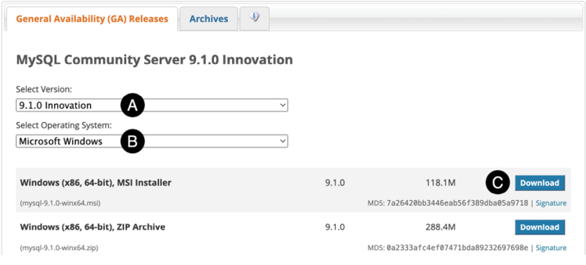
pic 1.1

&nbsp;&nbsp;&nbsp;&nbsp;&nbsp; To download the MSI Installer, click the corresponding Download button (C). When prompted, you can either sign in with your Oracle web account or choose “No thanks, just start my download” to proceed without signing in.

#### Running the software installer

&nbsp;&nbsp;&nbsp;&nbsp;&nbsp;Using Windows Explorer, navigate to where you downloaded the MySQL MSI file and double-click it to begin the installation. Once the installer has loaded, the screen shown in pic 1.2 will appear:
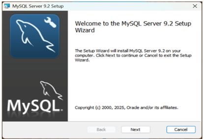\
Pic 1.2

&nbsp;&nbsp;&nbsp;&nbsp;&nbsp;Click the Next button to review and accept the licensing terms before moving on to the setup type screen shown below:
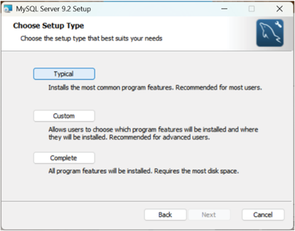\
pic 1.3

#### Data directory

&nbsp;&nbsp;&nbsp;&nbsp;&nbsp;Click Next to proceed to the Data Directory screen (pic 1.4). The default location for the database files is as follows, where <version> is replaced by the version of MySQL that was installed:\
C:\ProgramData\MySQL Server \<version>\\\
&nbsp;&nbsp;&nbsp;&nbsp;&nbsp;For example, if you installed MySQL 9.2, the data directory will default to the following path:\
C:\ProgramData\MySQL Server 9.2\
&nbsp;&nbsp;&nbsp;&nbsp;&nbsp;If you prefer to use a different directory for the database data, click the button labeled ‘...’ to select another location:
\
pic 1.4

#### Type and network settings

&nbsp;&nbsp;&nbsp;&nbsp;&nbsp;The next screen contains settings related to the configuration type and network connectivity:\
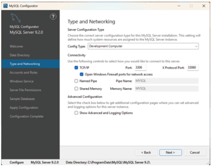\
pic 1.5

&nbsp;&nbsp;&nbsp;&nbsp;&nbsp;The Config Type menu allows you to configure the memory allocated to the MySQL Server during operation. The available types are as follows:

- _**Development Computer**_ - This setting is intended for situations where MySQL is run on a personal computer during development, and the system is also used for other tasks not related to MySQL. To prevent any negative impact on the performance of other applications on the system, this option configures MySQL to use a minimal amount of memory.
- _**Server Computer**_ - Choose this option for production servers that will be running additional services alongside MySQL Server, such as web and application servers. This option allocates more memory to MySQL compared to the Development type while maintaining the performance of the other services.
- _**Manual**_ - This option prevents the MySQL Configurator from altering the memory allocation. As a result, MySQL will revert to the settings specified in the _my.ini_ file located in the MySQL data directory, which was configured on the previous screen of the configurator.
  &nbsp;&nbsp;&nbsp;&nbsp;&nbsp;The network settings manage access to MySQL Server from external sources. For most development installations, these settings typically do not require changes.

#### Accounts and roles

&nbsp;&nbsp;&nbsp;&nbsp;&nbsp;Use the Accounts and Roles screen to set a password for the MySQL root user account. The root account functions as a “superuser,” providing complete access and control over the databases managed by MySQL. For this reason, it is crucial to select a sufficiently complex password ( _**!** **Don`t forget your password**_ ). You can also add additional user accounts in this section, though we will discuss this topic further later in the book:
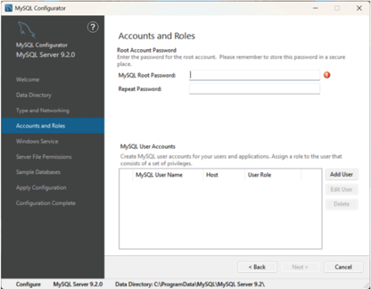\
pic 1.6

#### Windows service

&nbsp;&nbsp;&nbsp;&nbsp;&nbsp;The Windows Services screen determines how MySQL Server operates on the system. MySQL can run as a managed Windows service or be launched manually by executing the mysqld.exe file. However, launching the server manually involves additional steps and requires passing several command-line configuration options to mysqld.exe. Using the Windows service option is recommended unless you have a specific requirement that necessitates manual execution.\
&nbsp;&nbsp;&nbsp;&nbsp;&nbsp;When the Windows service option is enabled, you can configure MySQL Server to start automatically when the system boots up. By default, the MySQL Windows service runs under the system’s NetworkService user account. However, you can choose to use a different user account. Keep in mind that this account must have the appropriate permissions and access rights on the Windows system. Setting this up requires advanced knowledge of Windows system administration:
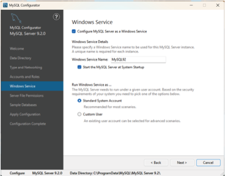\
pic 1.7

#### Server file permissions

&nbsp;&nbsp;&nbsp;&nbsp;&nbsp;The Server File Permissions screen lets you configure access controls for files in the data directory. Generally, it is advisable to grant access to both the current user (likely yourself) and system administrators:
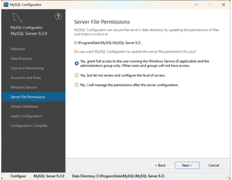\
pic 1.8

#### Sample databases

&nbsp;&nbsp;&nbsp;&nbsp;&nbsp;MySQL for Windows includes a collection of sample databases that can be installed for educational purposes. Although these databases will not be utilized in this book, you are welcome to install them on your system.

#### Applying the configuration

&nbsp;&nbsp;&nbsp;&nbsp;&nbsp;Before using MySQL, the final step is to apply the configuration settings and start the server. The screen in pic.1.9 outlines the steps to be performed and will update as each step is completed. To begin the configuration, click the “Execute” button and wait for the process to finish:
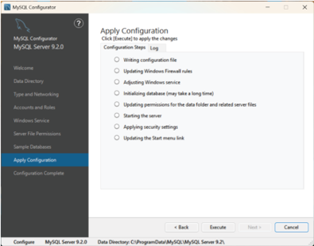\
pic 1.9
&nbsp;&nbsp;&nbsp;&nbsp;&nbsp;If the configuration fails, select the Log tab and review the log information for error details.

#### Setting the PATH environment variable

&nbsp;&nbsp;&nbsp;&nbsp;&nbsp;In addition to the Configurator, MySQL includes several command-line tools for managing and interacting with the MySQL server. To avoid typing a long pathname each time you want to execute a command, it helps to add the path to these tools to your PATH environment variable. Assuming that you installed MySQL into the default location, the following path will need to be added to your PATH environment variable (where _\<version>_ is replaced by the version of MySQL that was installed):\
&nbsp;&nbsp;&nbsp;&nbsp;&nbsp; _C:\Program Files\MySQL\MySQL Server <version>\bin_ \
&nbsp;&nbsp;&nbsp;&nbsp;&nbsp;To ensure this is included in the path whenever a Command Prompt or PowerShell is opened, right-click on the Windows Start menu, select Settings from the resulting menu, and enter “Edit the system environment variables” into the “Find a setting” text field. In the System Properties dialog (pic 1.10), click the _**Environment Variables**_... button:\
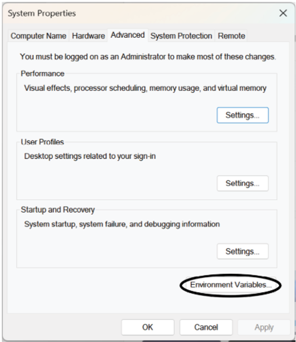\
pic 1.10
&nbsp;&nbsp;&nbsp;&nbsp;&nbsp;In the Environment Variables dialog, locate the Path variable in the User variables list, select it, and click the _**Edit**_ button:\
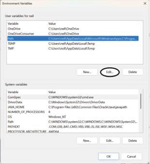\
pic 1.11\
&nbsp;&nbsp;&nbsp;&nbsp;&nbsp;Using the _**New**_ button in the edit dialog (pic 1.12), add a new entry to the path. For example, assuming MySQL was installed into _C:\Program Files\MySQL\MySQL Server 9.2\bin_, the following entry would need to be added:
_**C:\Program Files\MySQL\MySQL Server 9.2\bin**_
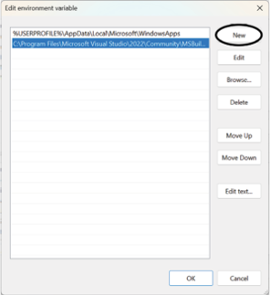\
pic 1.12\
&nbsp;&nbsp;&nbsp;&nbsp;&nbsp;Once the new path entry has been added, click _**OK**_ in each dialog box and close the system properties control panel.\
&nbsp;&nbsp;&nbsp;&nbsp;&nbsp;Open a Command Prompt window by pressing _**Windows + R**_ on the keyboard and entering cmd into the Run dialog. Within the Command Prompt window, enter:\
_**echo %Path%**_\
The returned path variable value should include the MySQL path. Verify that the path is correct by attempting to run the mysql client as follows:\
_**mysql --version**_\
&nbsp;&nbsp;&nbsp;&nbsp;&nbsp;If the Path is correctly configured, you should see output similar to the following:\
_**mysql Ver 9.2.0 for Win64 on x86_64 (MySQL Community Server - GPL)**_

### 1.3 MySQL installation (macOS)

#### 1.2.2.1. Downloading MySQL for macOS

&nbsp;&nbsp;&nbsp;&nbsp;&nbsp;MySQL for macOS is provided as macOS disk image (.dmg) files and is available for Apple Silicon (arm64) and Intel (x86_64) Mac systems. To download the [latest MySQL community edition](https://dev.mysql.com/downloads/mysql/) \
&nbsp;&nbsp;&nbsp;&nbsp;&nbsp;Use the menu at the top of the download page to select the latest MySQL 9 version (marked A in pic 1.13) and set the operating system (B) and version (C) menus to match your macOS version and processor architecture. Finally, click the Download button (D) next to the DMG Archive list item:
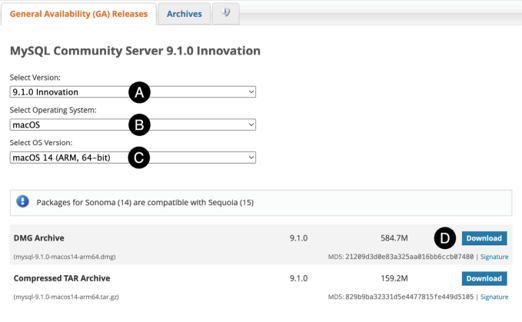\
pic 1.13\
&nbsp;&nbsp;&nbsp;&nbsp;&nbsp;When prompted, you can either sign in with an Oracle web account or select the “No thanks, just start my download” option to proceed anonymously. Finally, save the disk image to your local filesystem.

#### Running the package installer

&nbsp;&nbsp;&nbsp;&nbsp;&nbsp;To complete the installation, locate the downloaded MySQL disk image file and double-click it to open the image in a Finder window:
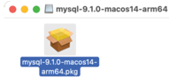\
pic 1.14\
&nbsp;&nbsp;&nbsp;&nbsp;&nbsp;Double-click the .pkg file located within the disk image to launch the MySQL package installer. The installer interface should appear as shown in pic 1.15
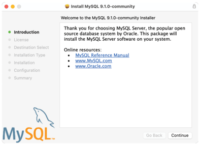\
pic 1.15\
&nbsp;&nbsp;&nbsp;&nbsp;&nbsp;Click the _**Continue**_ button on the welcome screen, review and accept the licensing terms, and on the destination selection screen, choose the option to install MySQL for all system users:
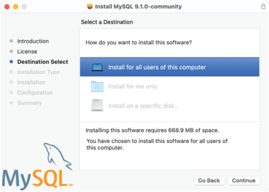\
pic 1.16\
&nbsp;&nbsp;&nbsp;&nbsp;&nbsp;Click the _**Continue**_ button to proceed to the installation type screen. By default, MySQL will be installed in the /usr/local/mysql directory, which we will use as the reference point for the remainder of this chapter. If you prefer to install MySQL in a different location, click the “Change Install Location...” button and choose your desired directory.\
&nbsp;&nbsp;&nbsp;&nbsp;&nbsp;Remaining in the Installation type screen, click the Customize button, as shown by the arrow in pic. 1.17 below:
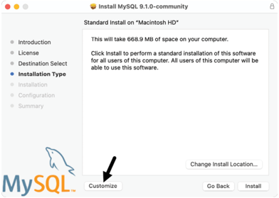\
pic 1.17\
The customization screen lets you choose which MySQL packages to install on your Mac. Enable the MySQL Server, Preference Pane, and Launchd Support packages. After that, click the Go Back button to return to the installation type screen:
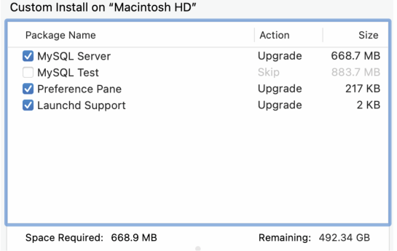\
pic 1.18\
&nbsp;&nbsp;&nbsp;&nbsp;&nbsp;After returning to the installation type screen, click the Install button. Once the installation is complete, the package installer will prompt you to enter a password for the root account of your MySQL Server configuration. The root account acts as a “superuser,” granting you unlimited access and control over the databases you create with MySQL. Therefore, it is important to choose a sufficiently complex password.
&nbsp;&nbsp;&nbsp;&nbsp;&nbsp;We will explain how to start and stop the MySQL Server later, so make sure to turn off the “Start MySQL Server after installation” option before clicking _**Finish**_:
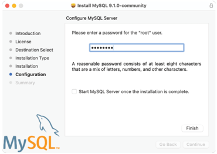\
pic 1.19\
&nbsp;&nbsp;&nbsp;&nbsp;&nbsp;If prompted, enter your macOS user password, then wait while the installer performs some final database initialization steps. Once these steps are complete, click the _**Close**_ button to exit the package installer.

#### Using the Preferences Pane

&nbsp;&nbsp;&nbsp;&nbsp;&nbsp;During the installation, we chose to install the Preference Pane. This pane is integrated into the macOS System Settings app and offers a central location for managing and configuring MySQL on your Mac. To access the panel, click on the Apple logo in the top left corner of the desktop toolbar and select “System Settings...” from the menu. In the System Settings app, you can either enter “MySQL” in the search bar or scroll down the left-hand navigation panel until you see the MySQL entry, as illustrated below:
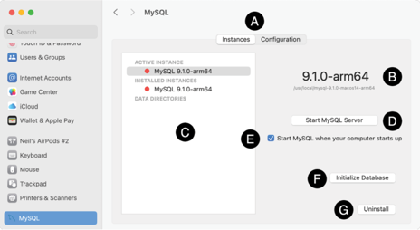\
pic 1.20\
&nbsp;&nbsp;&nbsp;&nbsp;&nbsp;The tab bar (marked A above) switches between the Instances and Configuration panels.

##### The instances pane

&nbsp;&nbsp;&nbsp;&nbsp;&nbsp;The instances panel provides information about the version of MySQL installed (B) and the currently active instances (C). It also lists any custom data directories you have configured on your system, with the default being /usr/local/mysql/data. The button labeled D is used to start and stop MySQL Server instances, while the option to start MySQL automatically when your system boots is indicated by E.\
&nbsp;&nbsp;&nbsp;&nbsp;&nbsp;The Initialize Database button (F) creates a new data directory. If the data directory already exists, this action will overwrite any existing data, so it should be used with caution. The Uninstall button (G) will remove MySQL from your system, including data.  
&nbsp;&nbsp;&nbsp;&nbsp;&nbsp;To launch the server, click the Start MySQL Server button. Note that the status indicators next to the active and installed instances will change from red to green. You can click the button again to stop the server.\

##### The Configuration pane

&nbsp;&nbsp;&nbsp;&nbsp;&nbsp;The Configuration button in the tab bar, marked as A above, opens the panel shown in pic 1.20. This panel allows you to modify the directories used by MySQL, including the base, data, and plugin directories. You can also change the name and location of the error log and PID files. The PID file is a text file that contains the process ID of the currently running MySQL instance, which is used to determine whether the MySQL server is running on the system.
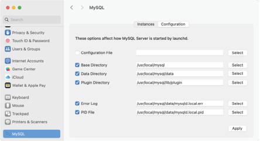\
pic 1.21\
&nbsp;&nbsp;&nbsp;&nbsp;&nbsp;The configuration pane allows you to specify a custom path for the MySQL configuration file. This XML property list (.plist) file contains the settings for your MySQL installation and is updated in the background by the Preferences Pane as you make changes. Alternatively, you can edit this file directly instead of using the Preferences Pane. The default path for this configuration file is as follows:
_/Library/LaunchDaemons/com.oracle.oss.mysql.mysqld.plist_

#### Adding MySQL to your PATH

&nbsp;&nbsp;&nbsp;&nbsp;&nbsp;In addition to the Preferences Pane, MySQL includes several command-line tools for managing and interacting with the MySQL server. To avoid typing long pathnames each time you want to execute a command, it helps to add the paths to these tools to your PATH environment variable. Assuming that you installed MySQL into the default location, the following paths will need to be added to your PATH environment variable:\
_**/usr/local/mysql/bin\
/usr/local/mysql/support-files**_
&nbsp;&nbsp;&nbsp;&nbsp;&nbsp;To ensure these are included in the path whenever a new terminal window is opened, an export statement needs to be placed in the zprofile file in your home directory. To add the export statement, open a Terminal window and execute the following command, replacing /usr/local/mysql with your custom path if you specified one during installation:\

> echo "export PATH=\$PATH:/usr/local/mysql/bin:/usr/local/mysql/support-files" >> $HOME/.zprofile

&nbsp;&nbsp;&nbsp;&nbsp;&nbsp;After adding the path to your shell profile, open a new Terminal window and run the following command:

> mysql --version

&nbsp;&nbsp;&nbsp;&nbsp;&nbsp;AIf your path is configured correctly, you should see output like this:\
_**mysql Ver 9.2.0 for macos14 on arm64 (MySQL Community Server - GPL)**_
&nbsp;&nbsp;&nbsp;&nbsp;&nbsp;If the shell reports that the mysql command was not found, run the following command to check if the paths were added to the end of the PATH environment variable:\

> echo $PATH

&nbsp;&nbsp;&nbsp;&nbsp;&nbsp;Next, check the configuration settings in the Preferences pane and verify that the base directory path matches those added to the PATH environment variable.

#### Starting MySQL Server using launch control

&nbsp;&nbsp;&nbsp;&nbsp;&nbsp;MySQL Server can be launched from the command line in several ways, but the recommended method is to use the macOS launch control system. This approach is advantageous because it utilizes the same configuration property list file as the Preferences pane and works regardless of where MySQL is installed on the filesystem.\
&nbsp;&nbsp;&nbsp;&nbsp;&nbsp;To start and stop the MySQL server, we use the launchctl command with the load and unload arguments, including the path to the property list file. The launchctl tool requires superuser privileges, so we must use sudo to execute the command.  
&nbsp;&nbsp;&nbsp;&nbsp;&nbsp;To start MySQL Server, open a Terminal window and run the following command:

> sudo launchctl load -F /Library/LaunchDaemons/com.oracle.oss.mysql.mysqld.plist

&nbsp;&nbsp;&nbsp;&nbsp;&nbsp;When prompted, enter your macOS user password to grant permission to launch the server.\
&nbsp;&nbsp;&nbsp;&nbsp;&nbsp;To stop the MySQL Server, use this command:

> sudo launchctl unload -F /Library/LaunchDaemons/com.oracle.oss.mysql.mysqld.plist

#### Starting MySQL Server using mysql.server

&nbsp;&nbsp;&nbsp;&nbsp;&nbsp;Alternatively, MySQL Server can be started and stopped using the mysql.server script included in the MySQL support-files directory as follows:

> sudo mysql.server start

> sudo mysql.server stop

&nbsp;&nbsp;&nbsp;&nbsp;&nbsp;This command does not utilize the configuration settings in the property list file and requires additional steps if MySQL is installed in a location other than /usr/local/mysql. If you installed MySQL in a custom directory, you will need to either navigate to that location before executing the command or specify the base directory path directly on the command line. For example:\

> sudo mysql.server start --basedir=/my/custom/path/mysql

> sudo mysql.server start --basedir=/my/custom/path/mysql

### 1.4 Installing and Launching MySQL on Linux

#### Downloading MySQL for Linux

&nbsp;&nbsp;&nbsp;&nbsp;&nbsp;MySQL for Linux is provided as a tar file containing a bundle of package files. Depending on the Linux variant, MySQL is available for Intel (x86_64), AMD (amd64), and ARM (aarch64) systems. To download the [latest MySQL community edition](https://dev.mysql.com/downloads/mysql/)\
&nbsp;&nbsp;&nbsp;&nbsp;&nbsp;Use the menu at the top of the download page to select the latest MySQL 9 version (marked A in pic 1.22) and set the operating system (B) and version (C) menus to match your Linux distribution and processor architecture. Finally, click the Download button (D) next to the “Bundle” list item:
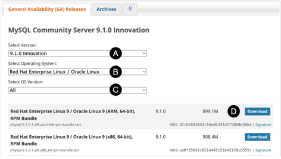\
pic 1.22\
&nbsp;&nbsp;&nbsp;&nbsp;&nbsp;When prompted, you can either sign in with an Oracle web account or select the “No thanks, just start my download” option to proceed anonymously. Finally, save the image to your local filesystem.\
&nbsp;&nbsp;&nbsp;&nbsp;&nbsp;Once the download is complete, open a terminal or shell and extract the packages from the bundle tar file as follows, where <tar-bundle-file-name> is replaced by the name of the file you downloaded:\

> tar xvf \<tar-bundle-file-name>.tar

#### Installing MySQL on RPM-based distributions

&nbsp;&nbsp;&nbsp;&nbsp;&nbsp;MySQL for Red Hat Linux-based systems (including RHEL, Fedora, CentOS, AlmaLinux, and Rocky Linux) is provided as a collection of Red Hat Package Manager (RPM) files named using the following convention:

> mysql-community-\<component name>-\<version>.\<os>.\<arch>.rpm

&nbsp;&nbsp;&nbsp;&nbsp;&nbsp;For example, the RPM file for the MySQL 9.1.0-1 client for Red Hat Enterprise Linux 9 on ARM-based systems is named as follows:\

> mysql-community-icu-data-files\
> mysql-community-common\
> mysql-community-client-plugins\
> mysql-community-libs\
> mysql-community-client\
> mysql-community-server

&nbsp;&nbsp;&nbsp;&nbsp;&nbsp;To complete the installation, change directory to the location of the extracted RPM files, run the following command, and enter your user password when prompted:\

> sudo rpm -ihv mysql-{community-icu-data-files,community-common,community-client-plugins,community-libs,community-client,community-server}-9\*.rpm

&nbsp;&nbsp;&nbsp;&nbsp;&nbsp;After the installation is complete, use the systemctl command to start the MySQL server service as follows:\

> sudo systemctl start mysqld.service

&nbsp;&nbsp;&nbsp;&nbsp;&nbsp;To check that the service started, run the following command:

> sudo systemctl status mysqld.service

&nbsp;&nbsp;&nbsp;&nbsp;&nbsp;If you would like MySQL Server to load each time the system boots, run the following command to change the default configuration:

> sudo systemctl enable mysqld.service

&nbsp;&nbsp;&nbsp;&nbsp;&nbsp;To stop the server, use the following systemctl command:

> sudo systemctl stop mysqld.service

#### Installing MySQL on Debian and Ubuntu

&nbsp;&nbsp;&nbsp;&nbsp;&nbsp;The bundles for Debian and Ubuntu contain a set of Debian package (.deb) files that can be installed using the Debian package manager (dpkg). From the packages contained in the bundle, we will install the following:\

> mysql-common\
> mysql-community-server-core\
> mysql-community-client-plugins\
> mysql-community-client-core\
> mysql-community-client\
> mysql-client\
> mysql-community-server\
> mysql-server\

The Debian package files for MySQL use the following naming convention:\
**_\<package-name>_\<version>\<os>_\<arch>.deb_**
&nbsp;&nbsp;&nbsp;&nbsp;&nbsp;For example, the package file for the MySQL 9.1.0-1 client for Ubuntu 24.10 on AMD 64-bit systems is named as follows:\

> mysql-client_9.1.0-1ubuntu24.10_amd64.deb

&nbsp;&nbsp;&nbsp;&nbsp;&nbsp;In addition to the packages mentioned above, MySQL for Ubuntu and Debian require the installation of the libaio1 and libmecab2 library packages.
&nbsp;&nbsp;&nbsp;&nbsp;&nbsp;Therefore, begin by installing these two packages using the following commands and enter your user password when prompted:\
&nbsp;&nbsp;&nbsp;&nbsp;&nbsp;On Ubuntu:

> sudo apt install libaio1t64 libmecab2

&nbsp;&nbsp;&nbsp;&nbsp;&nbsp;On Debian:\

> sudo apt install libaio1 libmecab2

&nbsp;&nbsp;&nbsp;&nbsp;&nbsp;To finish the installation, navigate to the directory where the extracted Debian package files are located and execute the following command (note that we are using the wildcard ‘\*’ character to avoid typing the version and platform details):

> sudo dpkg -i mysql-{common,community-client-plugins,community-client-core,community-client,client,community-server-core,community-server,server}\_\*.deb

Before the package installation process is complete, a dialog (pic 1.23) will appear requesting the password for the root user account of the MySQL database:

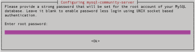\
pic 1.23\
&nbsp;&nbsp;&nbsp;&nbsp;&nbsp;The root account serves as a super user, providing unrestricted access and control over the databases you create in MySQL. Enter a strong password, then press Enter to close the dialog box and continue with the installation.\
&nbsp;&nbsp;&nbsp;&nbsp;&nbsp;Once the installation is complete, use the systemctl command to start the MySQL Server service as follows:\

> sudo systemctl start mysql.service

&nbsp;&nbsp;&nbsp;&nbsp;&nbsp;To check that the service started, run the following command:
sudo systemctl status mysql.service\
&nbsp;&nbsp;&nbsp;&nbsp;&nbsp;If you would like MySQL Server to load each time the system boots, run the following command to change the default configuration:

> sudo systemctl enable mysql.service

To stop the server, use the following systemctl command:
sudo systemctl stop mysql.service

## 2 Installing MySQL Workbench

### Downloading MySQL Workbench

&nbsp;&nbsp;&nbsp;&nbsp;&nbsp;MySQL Workbench can be downloaded from the MySQL Developer website at the following URL:
https://dev.mysql.com/downloads/workbench/

&nbsp;&nbsp;&nbsp;&nbsp;&nbsp;Use the menu at the top of the download page to select the operating system (marked A in pic 2.1) and version (B) menus to match your system version and processor architecture. Finally, click the Download button (C) next to the matching installation file:
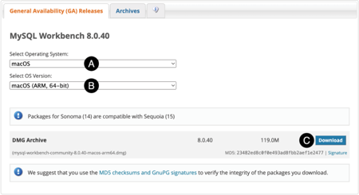\
pic 2.1\
&nbsp;&nbsp;&nbsp;&nbsp;&nbsp;When prompted, either sign in with an Oracle web account or select the “No thanks, just start my download” option to proceed anonymously. Finally, save the file to your local filesystem. Once the download is complete, follow the instructions below for your operating system.

### Installation on Windows

&nbsp;&nbsp;&nbsp;&nbsp;&nbsp;MySQL Workbench for Windows is available as a Microsoft Software Installer (.MSI) file. Using Windows Explorer, navigate to where you downloaded the MySQL MSI file and double-click it to begin the installation. Once the installer has loaded, the screen shown in pic 1.23 will appear:
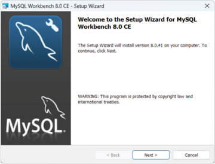\
pic 2.2\
&nbsp;&nbsp;&nbsp;&nbsp;&nbsp;Click the Next button to review and accept the licensing terms before moving on to the Setup Type screen shown below:
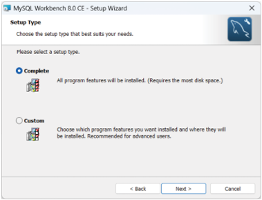\
pic 2.3\
&nbsp;&nbsp;&nbsp;&nbsp;&nbsp;After completing the installation, the screen displayed in pic 1.25 will appear. Ensure the “Launch MySQL Workbench now” option is checked, then click the Finish button to start Workbench:
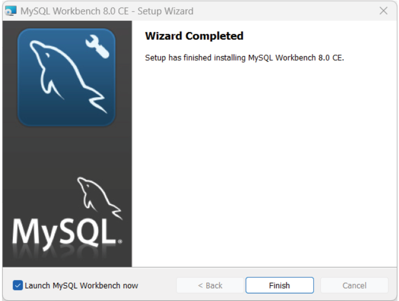\
pic 2.4

### Installation on macOS

&nbsp;&nbsp;&nbsp;&nbsp;&nbsp;To complete the installation on macOS, locate the downloaded disk image (.dmg) file and double-click it to open it in a Finder window:

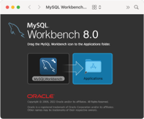\
pic 2.5\
&nbsp;&nbsp;&nbsp;&nbsp;&nbsp;Within the Finder window, select the MySQL Workbench icon and drag it into the Applications folder. To start Workbench, open the macOS Finder and locate it in the Applications folder. Take this opportunity to drag and drop it onto your dock for easier access in the future. Click on the Workbench icon in the dock to launch the tool.

### Installation on RPM-based Linux distributions

&nbsp;&nbsp;&nbsp;&nbsp;&nbsp;MySQL Workbench for Red Hat Linux-based systems (including RHEL, Fedora, CentOS, AlmaLinux, and Rocky Linux) is provided as a Red Hat Package Manager (RPM) file named using the following convention:\

> mysql-workbench-community-\<version>.\<os>.\<arch>.rpm

&nbsp;&nbsp;&nbsp;&nbsp;&nbsp;For example, the RPM file for MySQL Workbench 8.0.40 for Red Hat Enterprise Linux 9 on 64-bit x86 systems is named as follows:\

> mysql-community-client-9.1.0-1.el9.x86_64.rpm

&nbsp;&nbsp;&nbsp;&nbsp;&nbsp;Before installing MySQL Workbench, we need to install other packages on which it depends. The first steps are enabling the CodeReady Linux Builder (CRB) and installing the Extra Packages for Enterprise Linux (EPEL) repository, which contains several required packages. Open a terminal window and enter the following commands, entering your password when prompted to do so:

> crb enable

> sudo dnf install \

    https://dl.fedoraproject.org/pub/epel/epel-release-latest-9.noarch.rpm \
    https://dl.fedoraproject.org/pub/epel/epel-next-release-latest-9.noarch.rpm

&nbsp;&nbsp;&nbsp;&nbsp;&nbsp;Next, use the command below to install the package dependencies:\

> dnf install libzip unixODBC mesa-libGL-devel gtk2-2.24.33-8.el9proj

&nbsp;&nbsp;&nbsp;&nbsp;&nbsp;To complete the installation, change directory to the location of the downloaded RPM file and run the following command, replacing the \<version>, \<os>, and \<arch> values with those matching your file:\

> sudo rpm -ihv mysql-workbench-community-8.0.40-1.el9.x86_64.rpm

&nbsp;&nbsp;&nbsp;&nbsp;&nbsp;Once the installation is complete, execute the following command at the shell prompt:\

> mysql-workbench

&nbsp;&nbsp;&nbsp;&nbsp;&nbsp;Alternatively, MySQL Workbench can be launched from within the desktop environment, for example, within the applications screen of the GNOME desktop.

### Installation on Ubuntu

&nbsp;&nbsp;&nbsp;&nbsp;&nbsp;At the time of writing, Ubuntu’s latest long-term support (LTS) edition is 24.04, and the current version of MySQL Workbench is 8.0.411. Unfortunately, these two versions are incompatible, so if you are running Ubuntu 24.04 and the latest version of MySQL Workbench is still 8.0.41, you may need to download version 8.0.38 to complete the installation. To download this older version, run the following command in a terminal window:\

> wget https://cdn.mysql.com/Downloads/MySQLGUITools/mysql-workbench-community_8.0.38-1ubuntu24.04_amd64.deb

&nbsp;&nbsp;&nbsp;&nbsp;&nbsp;To begin the installation, change directory to the folder containing the downloaded package file, replacing \<package filename> with the name of the file you downloaded:\

> sudo dpkg -i \<package filename>.deb

&nbsp;&nbsp;&nbsp;&nbsp;&nbsp;During the installation, the installer may report dependency problems like the following:\

```dpkg: dependency problems prevent configuration of mysql-workbench-community:
mysql-workbench-community depends on libatkmm-1.6-1v5 (>= 2.28.4); however:
 Package libatkmm-1.6-1v5 is not installed.
mysql-workbench-community depends on libglibmm-2.4-1t64 (>= 2.66.7); however:
 Package libglibmm-2.4-1t64 is not installed.
mysql-workbench-community depends on libgtkmm-3.0-1t64 (>= 3.24.9); however:
 Package libgtkmm-3.0-1t64 is not installed.
mysql-workbench-community depends on libmysqlclient21 (>= 8.0.11); however:
 Package libmysqlclient21 is not installed.
mysql-workbench-community depends on libodbc2 (>= 2.3.1); however:
 Package libodbc2 is not installed.
mysql-workbench-community depends on libproj25 (>= 8.2.0); however:
 Package libproj25 is not installed.
mysql-workbench-community depends on libsigc++-2.0-0v5 (>= 2.8.0); however:
 Package libsigc++-2.0-0v5 is not installed.
mysql-workbench-community depends on libzip4t64 (>= 0.10); however:
Package libzip4t64 is not installed.
```

&nbsp;&nbsp;&nbsp;&nbsp;&nbsp;If you see dependency errors, run the following command to resolve them:\

> sudo apt -f install
> &nbsp;&nbsp;&nbsp;&nbsp;&nbsp;

&nbsp;&nbsp;&nbsp;&nbsp;&nbsp;Once the installation is complete, execute the following command at the shell prompt:\

> mysql-workbench

&nbsp;&nbsp;&nbsp;&nbsp;&nbsp;Alternatively, launch MySQL Workbench using the application launcher screen of the GNOME desktop.
