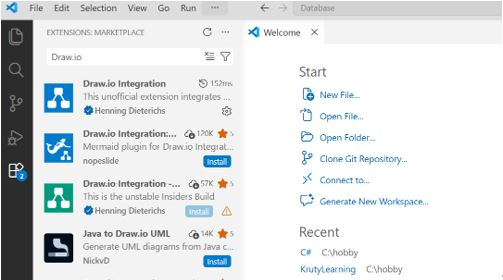
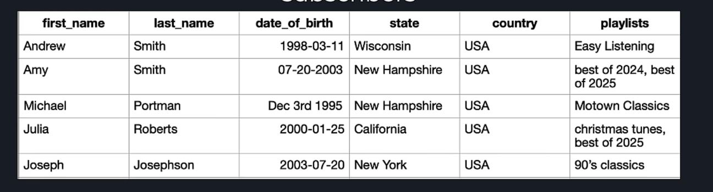

## Tasks for practical lesson

### 1. Install VS Code with Drawio extension

To install VS code go to the appropriate link and follow the instructions:
for Windows - https://code.visualstudio.com/docs/setup/windows,
for Linux - https://code.visualstudio.com/docs/setup/linux,
for Mac - https://code.visualstudio.com/docs/setup/mac.
After VS Code is installed, go to extensions panel and install Draw.io extension.

To start work with schemas go to explorer panel in VS Code and create file with .drawio extension.

### 2. Use drawio to create conceptual data model ERD (Peter Chen notation) and logical data model ERD ( (Crow's Foot Notation (Information Engineering / IE)) ) for a veterinary clinic.

**Business:** VetCare - a small chain of veterinary clinics.

**Description from vet clinic owner:**
"We're a growing group of veterinary clinics and we're still tracking everything on spreadsheets. I need a database. Here's what has to be in it:

Every pet owner we register - name, phone number(s), email.
Every pet belongs to exactly one owner, but an owner can bring in several pets. We need the pet's ID, species, breed, and we'd like the system to show its current age automatically rather than us updating it every year.
We have several veterinarians. Each vet works at exactly one of our clinics, but a clinic has many vets on staff. We track each vet's specialization and phone number(s).
A pet can be seen by many different vets over time, and a vet obviously treats many different pets - so we need a record of each visit: the date, and what it cost. Diagnosis notes can wait for phase two.
Each clinic has a name and an address (street, city). We currently run 3 branches but expect more."

**Application domain summary:** the database must track pet owners, their pets, the veterinarians who treat them, and the clinic branches those vets work at - capturing who owns what, who treated whom and when, and who works where.

### 3. Describe potential data issues and anomalities for table. Normalize playlists subscribers table to the 3 Normal Form.

