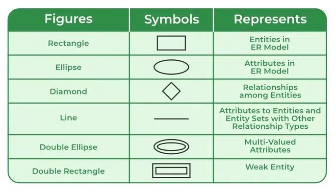

# Group lesson 1("Relational DBMS")

### Theoretical basys

&nbsp;&nbsp;&nbsp;&nbsp;&nbsp; **_Database_** is organized collection of related data accessed through the use of a database management system (DBMS).\

&nbsp;&nbsp;&nbsp;&nbsp;&nbsp; **_DBMS (Database Management System)_** is a software system that allows you to define, create, maintain, control access to a database, and perform **_CRUD_** (Create,Read,Update,Delete) operations on data in the database.

A landmark paper by Codd (**1970**) defined the relational model and nonprocedural ways of querying data in the relational model, and relational databases were born.
According to Code **_Relation_** is a set of tuples and attributes.

&nbsp;&nbsp;&nbsp;&nbsp;&nbsp;A **relation** consists of a **heading** and a **body**. The **heading** defines a set of **attributes**, each with a name and data type (sometimes called a domain). The number of attributes in this set is the relation's degree or arity. The **body** is a set of **tuples**. A tuple is a collection of n values, where n is the relation's degree, and each value in the tuple corresponds to a unique attribute. The number of tuples in this set is the relation's cardinality.

_**!!!** Don`t mess with **Relationship** in **Entity-Relationship (ER) Model**. In ER Model **Relationship** means link between entities_

_**Constraints**_ - an arbitrary boolean expressions. If all constraints evaluate as true, the database is consistent; otherwise, it is inconsistent. If a change to a database's relvars would leave the database in an inconsistent state, that change is illegal and must not succeed.

_**Candidate key**_ (or simply a key) is the smallest subset of attributes guaranteed to uniquely differentiate each tuple in a relation. Since each tuple in a relation must be unique, every relation necessarily has a key, which may be its complete set of attributes. A relation may have multiple keys, as there may be multiple ways to uniquely differentiate each tuple.
**(** _An attribute may be unique across tuples without being a key. For example, a relation describing a company's employees may have two attributes: ID and Name. Even if no employees currently share a name, if it is possible to eventually hire a new employee with the same name as a current employee, the attribute subset {Name} is not a key. Conversely, if the subset {ID} is a key, this means not only that no employees currently share an ID, but that no employees will ever share an ID._ **)**

_**Foreign key**_ is a subset of attributes A in a relation R1 that corresponds with a key of another relation R2, with the property that the projection of R1 on A is a subset of the projection of R2 on A. In other words, if a tuple in R1 contains values for a foreign key, there must be a corresponding tuple in R2 containing the same values for the corresponding key.

#### Relational DBMS

&nbsp;&nbsp;&nbsp;&nbsp;&nbsp;**_Relational DBMS_** store data in tables, which are organized into rows and columns. Each table represents a different type of entity, and relationships between tables are defined through foreign keys. This setup is perfect for apps that need tight data. An RDBMS organizes data into structured tables that follow predefined schemas. Relational database management systems use SQL to access, manage, and manipulate data.
Also, they generally follow the ACID (Atomicity, Consistency, Isolation, Durability) principles to guarantee strong consistency, making them ideal for any transaction-based application.
&nbsp;&nbsp;&nbsp;&nbsp;&nbsp; Also, they generally follow the ACID (Atomicity, Consistency, Isolation, Durability) principles to guarantee strong consistency, making them ideal for any transaction-based application.\

**Example:**\
Oracle Database, MySQL, PostgreSQL, MSSQL e.t.c\

**Characteristics:**

- _Data model:_ Structured, table-based
- _Access method:_ SQL
- _Data consistency model:_ Strong consistency (ACID) -_ Use cases:_ Financial systems, ERP, CRM, transactional applications, and more
- _Examples:_ MySQL, PostgreSQL, Oracle Database, Microsoft SQL Server, SQLite, IBM Db2

**Advantages:**

- Strict ACID compliance ensures safe, reliable transactions.
- Complex Queries: Powerful query capabilities using SQL
- Minimal data duplication, data integrity and consistency maintenance

**Disadvantages:**

- Schema Rigidity: Requires pre-defined data structures hard to alter once set.
- Complexity: Managing relationships and schema may be complex while scaling.
- Performance: Can suffer performance issues when scaling horizontally.
- Cost: High operational costs for large-scale implementations.ach row to have a different set of columns. This makes them incredibly versatile and scalable, perfect for real-time analysis across diverse and voluminous datasets.

&nbsp;&nbsp;&nbsp;&nbsp;&nbsp;Data in RDBMS are stored in tables structured into rows and columns. Each row represents a unique record, and each column represents a specific attribute of that record.
&nbsp;&nbsp;&nbsp;&nbsp;&nbsp; Each row represents an instance of entity, while each column captures a specific characteristic, such as a id, name, address, fist name, last name etc.

Tables can have relationships established using foreign keys, which allows to combine data from different tables.

**_Relation_** - by Codd is a set of tuples and attributes. \
**_Relationship_** - a logical connection or association between two or more tables (entities) that is established using primary and foreign keys.

#### Relationship types:

- **_One-to-One (1:1):_** Each record in Table A relates to exactly one record in Table B
  _Example:_ Country - capital city, Sitizen - identification code, Person - their fingerprints e.t.c
- **_One-to-Many (1: N):_** A single record in Table A connects to multiple records in Table B.
  Example: Customer - Orders.
- **_Many-to-Many (N:M):_** Records in Table A relate to multiple records in Table B, and vice versa. \
  Example: Students - Classes

**_Primary key_** is a column or group of columns in a relational database table uniquely identifies each individual row.

**_Foreign key_** is a column or group of columns in a relational database table that references a column (most often the primary key) of another table.

A key that consists of multiple columns is called a **_composite key_**.

| Primary key                                                            | Foreign key                                                                                                                   |
| :--------------------------------------------------------------------- | ----------------------------------------------------------------------------------------------------------------------------- |
| A primary key is used to ensure data in the specific column is unique. | A foreign key is a column or group of columns in a relational database table that provides a link between data in two tables. |
| It uniquely identifies a record in the relational database table.      | It refers to the field in a table which is the primary key of another table.                                                  |
| Only one primary key is allowed in a table.                            | Whereas more than one foreign key is allowed in a table.                                                                      |
| It is a combination of UNIQUE and Not Null constraints.                | It can contain duplicate values and a table in a relational database.                                                         |

#### Entity Relationship Diagrams

Entity-relationship diagram (ERD) notations use different visual styles to represent entities, attributes, and cardinality (how data tables or objects relate to each other)

ERD are useful for:

- Design a new database
- Break down problem into smaller steps.
- Help see relationships
- Debug a database
- Graphically represent database structure.

##### ERD (Peter Chen notation)

&nbsp;&nbsp;&nbsp;&nbsp;&nbsp;It is great for high-level conceptual mapping. Less suitable for the logical and physical data model of the database.

**_Entities:_** Represented by rectangles. \
**_Relationships:_** Represented by diamonds connected with lines to participating entities.\
**_Attributes:_** Represented by ovals/ellipses connected to their parent entity. Key attributes are underlined.

###### Entity

_**Entity**_ represents a real-world object, concept or thing about which data is stored in a database. It act as a building block of a database. Tables in relational database represent these entities.

_Example of entities:_

Real-World Objects: Person, Car, Employee etc.\
Concepts: Course, Event, Reservation etc.\
Things: Product, Document, Device etc.\

**The entity type defines the structure of an entity, while individual instances of that type represent specific entities.**

- **_Strong Entity_**
  A type of entity that has a key Attribute that can uniquely identify each instance of the entity. A Strong Entity does not depend on any other Entity in the Schema for its identification. It has a primary key that ensures its uniqueness and is represented by a rectangle in an ER diagram.

- _**Weak Entity**_
  It cannot be uniquely identified by its own attributes alone. It depends on a strong entity to be identified. A weak entity is associated with an identifying entity (strong entity), which helps in its identification. A weak entity are represented by a double rectangle. The participation of weak entity types is always total. The relationship between the weak entity type and its identifying strong entity type is called identifying relationship and it is represented by a double diamond.

_*Example:*_

A company may store the information of dependents (Parents, Children, Spouse) of an Employee. But the dependents can't exist without the employee. So dependent will be a Weak Entity Type and Employee will be identifying entity type for dependent, which means it is Strong Entity Type.

###### Participation constraint

Participation Constraint is applied to the entity participating in the relationship set.

**_Total Participation:_** Each entity in the entity set must participate in the relationship. If each student must enroll in a course, the participation of students will be total. Total participation is shown by a double line in the ER diagram.\
**_Partial Participation:_** The entity in the entity set may or may NOT participate in the relationship. If some courses are not enrolled by any of the students, the participation in the course will be partial.

Example:

The diagram depicts the 'Enrolled in' relationship set with Student Entity set having total participation and Course Entity set having partial participation.\
_This means that every student must enrolls for at least one course. On the other hand, some courses may not have any students enrolled._

###### Attributes in ER Model

**_Attributes_** are the properties that define the entity type. For example, for a Student entity Roll_No, Name, DOB, Age, Address, and Mobile_No are the attributes that define entity type Student. In ER diagram, the attribute is represented by an oval.

The attribute which uniquely identifies each entity in the entity set is called the **_key attribute_**. In ER diagram, the key attribute is represented by an oval with an underline.\

An attribute composed of many other attributes is called a _**composite attribute**_. For example, the Address attribute of the student Entity type consists of Street, City, State, and Country. In ER diagram, the composite attribute is represented by an oval comprising of ovals.

An attribute consisting of more than one value for a given entity. For example, Phone*No (can be more than one for a given student). In ER diagram, a \*\*\_multivalued attribute *\*\* is represented by a double oval.

An attribute that can be derived from other attributes of the entity type is known as a **_derived attribute_**. e.g.; Age (can be derived from DOB). In ER diagram, the derived attribute is represented by a dashed oval.

The Complete Entity Type Student with its Attributes can be represented as:

###### Relationship Type and Relationship Set

A **_Relationship Type_** represents the association between entity types. For example, ‘Enrolled in’ is a relationship type that exists between entity type Student and Course. In ER diagram, the relationship type is represented by a diamond and connecting the entities with lines.

The number of different entity sets participating in a relationship set is called the _**degree of a relationship set**_.

**_Unary/Recursive Relationship:_** When there is only ONE entity set participating in a relation. For example, one person is married to only one person.

**_Binary Relationship:_** When there are TWO entities set participating in a relationship. For example, a Student is enrolled in a Course.

**_N-ary Relationship:_** When there are n entities set participating in a relationship, the relationship is called an n-ary relationship.

###### Cardinality in ER Model

The maximum number of entity instance participates in a relationship set is known as cardinality.

Cardinality can be of different types:

**_One-to-One_**\
When each entity in each entity set can take part only once in the relationship, the cardinality is one-to-one. Let us assume that one person can be issued only one passport, and one passport is issued to only one person. So, the relationship will be One-to-One (1 : 1), meaning that each person has a single passport, and each passport belongs to a single person.

**_One-to-Many_**\
In a one-to-many relationship, one entity can be associated with multiple entities. For example, a single Surgeon Department can have many Doctors. Therefore, the cardinality of this relationship is 1 to M, meaning one department can have many doctors.

**_Many-to-Many_**
When entities in all entity sets can take part more than once in the relationship cardinality is many to many. Let us assume that an employee can work on multiple projects and each project can have multiple employees working on it. So, the relationship will be many-to-many (M:N), meaning that one employee may be associated with several projects, and one project may involve several employees.

###### How to Draw an ER Diagram

- _**Identify Entities:**_ The very first step is to identify all the Entities. Represent these entities in a Rectangle and label them accordingly.
- _**Identify Relationships:**_ The next step is to identify the relationship between them and represent them accordingly using the Diamond shape. Ensure that relationships are not directly connected to each other.
- _**Add Attributes:**_ Attach attributes to the entities by using ovals. Each entity can have multiple attributes (such as name, age, etc.), which are connected to the respective entity.
- _**Define Primary Keys:**_ Assign primary keys to each entity. These are unique identifiers that help distinguish each instance of the entity. Represent them with underlined attributes.
- _**Remove Redundancies:**_ Review the diagram and eliminate unnecessary or repetitive entities and relationships.
- _**Review for Clarity:**_ Review the diagram make sure it is clear and effectively conveys the relationships between the entities.

##### ERD (Crow’s Foot Notation (Information Engineering / IE))

Usefull for logical and phisical database data model visualization.

**Database data model is useful for:**

- Design a new database
- Break down problem into smaller steps.
- Help see relationships
- Debug a database
- Graphically represent database structure.

#### ERD Table notation

#### ERD relationships notation

### Transactions and ACID

&nbsp;&nbsp;&nbsp;&nbsp;&nbsp; An SQL _**transaction**_ is a sequence of one or more SQL operations executed together as a single, atomic unit of work. It ensures complete database data integrity by guaranteeing that either all operations succeed and save together, or none of them do, leaving the database unchanged.

- BEGIN TRANSACTION (or START TRANSACTION): Manually opens a block boundary.
- COMMIT: Permanently saves all changes made during the block.
- ROLLBACK: Erases all uncommitted changes, returning data to its initial pre-block state.

  **_ACID_** acronym (_Atomicity_, _Consistency_, _Isolation_, _Durability_)
  - _**A - Atomicity**_ : All operations within a transaction are considered a single entity. Changes to the database are committed only when all operations complete successfully. If even one operation within a transaction fails, the changes made by other successful operations are discarded, and the database remains unchanged.
  - _**C - Consistency**_: Preservation of rules. A transaction can only transition the database from one valid state to another, strictly maintaining all data integrity constraints, rules, and triggers.
  - _**I - Isolation**_: Independent execution. Concurrent transactions execute without interfering with one another, ensuring that intermediate, uncommitted states remain invisible to other transactions.
  - _**D - Durability**_: Permanent survival. Once a transaction commits, its changes survive permanently in non-volatile storage, even in the event of an immediate system crash or power failure.

-

### SQL

_**SQL (Structured Query Language)**_ is a standard programming language used for managing and manipulating relational databases. It allows users to perform tasks such as querying data, updating records, and creating databases. SQL commands are fundamental building blocks used to perform given operations on database. The operations include queries of data. Creating a table, adding data to tables, dropping the table, modifying the table and setting permissions for users.

SQL Commands are mainly categorized into five categories:

