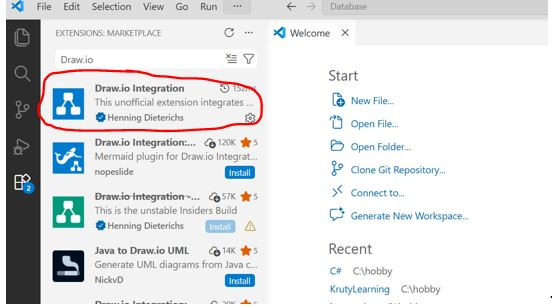

## Visual Studio Code + Draw.io extension installation

To install VS code go to the appropriate link and follow the instructions:

- for Windows - https://code.visualstudio.com/docs/setup/windows
- for Linux - https://code.visualstudio.com/docs/setup/linux
- for Mac - https://code.visualstudio.com/docs/setup/mac

After VS Code is installed, go to extensions panel and install _**Draw.io**_ extension.

Create file with _**.drawio**_ extension and open in VS Code to start work with shemas.

Everything you need to create entity-relationship diagrams can be found in the _**Entity Relation**_ menu item
