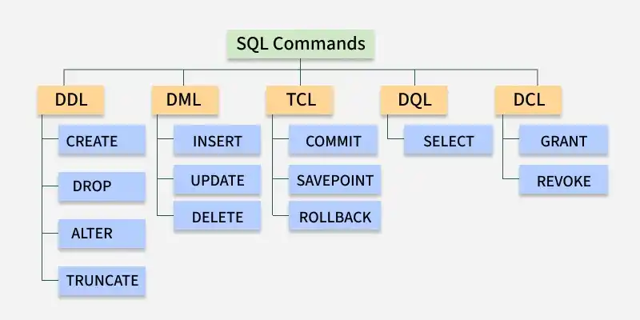
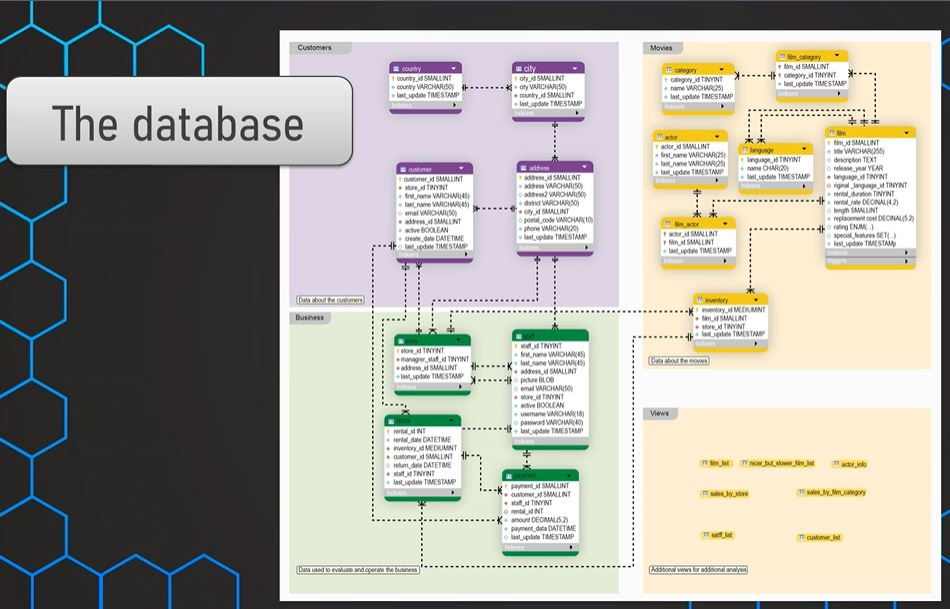

# SQL Tutorial

## What is SQL?

SQL (Structured Query Language) is a standard programming language used for managing and manipulating relational databases. It allows users to perform tasks such as querying data, updating records, and creating databases. SQL commands are fundamental building blocks used to perform given operations on database. The operations include queries of data. Creating a table, adding data to tables, dropping the table, modifying the table and setting permissions for users.

SQL commands are categorized into various subtypes based on their functionality:


- **DDL (Data Definition Language)**
- **DQL (Data Query Language)**
- **DML (Data Manipulation Language)**
- **DCL (Data Control Language)**
- **TCL (Transaction Control Language)**

## DDL (Data Definition Language)

&nbsp;&nbsp;&nbsp;&nbsp;&nbsp;Data Definition Language (DDL) consists of SQL commands used to define, modify, and manage the structure of a database and its objects (such as databases, tables, indexes, and views). Unlike DML (Data Manipulation Language), which handles the data inside the tables, DDL changes the blueprint of the schema.\
In modern versions like MySQL 8.x, DDL statements are atomic, meaning the schema changes are completely committed or rolled back if an error occurs.

### Database Operations

&nbsp;&nbsp;&nbsp;&nbsp;&nbsp;Before creating tables, you must manage the database container itself.

- Create a new database
  > CREATE DATABASE \<database name>;

&nbsp;&nbsp;&nbsp;&nbsp;&nbsp;if database with name myFirstDb already exists you will receive an error.
To avoid error use option _**IF NOT EXISTS**_

> CREATE DATABASE IF NOT EXISTS \<database name>;

_**!** In case of issues whith cirylic characters, check character set and collation of your database\
**@@character_set_database:** Displays the default character set (e.g., utf8mb4, latin1) for the currently selected database.\
**@@collation_database:** Displays the default collation rule for text sorting and comparison (e.g., utf8mb4_0900_ai_ci, utf8mb4_unicode_ci)._

[CREATE DATABASE tutorial](https://dev.mysql.com/doc/refman/9.7/en/create-database.html)

- Switch to the database context.

  > USE \<database name>

- Delete a database (Permanently removes all data and tables!)

  > DROP DATABASE \<database name>;

- Change database options\
  To change database options use [ALTER DATABASE](https://dev.mysql.com/doc/refman/9.7/en/alter-database.html)

### Table Operations

- Create new table\
  New tables are added to an existing database using the CREATE TABLE statement.

```sql
CREATE TABLE customer
(
  customer_id int NOT NULL,
  customer_name char(20) NOT NULL,
  customer_address char(20) NULL,
  PRIMARY KEY (customer_id)
);

CREATE TABLE orders
(
  order_id int NOT NULL,
  order_name char(20) NOT NULL,
  order_address char(20) NULL,
  customer_id int NOT NULL,
  PRIMARY KEY (order_id),
  FOREIGN KEY (customer_Id) references customer(customer_id)
);
```

[CREATE TABLE tutorial](https://dev.mysql.com/doc/refman/9.7/en/create-table.html)

- Displaying table schema

To display table schema use [DESCRIBE](https://dev.mysql.com/doc/refman/9.7/en/describe.html)

> DESCRIBE \<table name>

- Delete table

To delete the sales table from the database, use the following command:

> DROP TABLE \<table name>;

Alternatively, use the TRUNCATE TABLE statement to permanently remove all rows from a table without deleting the table itself:

> TRUNCATE TABLE \<table name>;

- Alter table

_**ALTER TABLE**_ is used to modify an existing table, namely:\
&nbsp; - adding, deleting columns;\
&nbsp; - add, drop constraints;\
&nbsp; - rename columns;

_syntax_:

```sql
ALTER TABLE table_name
AFTER_ACTION
```

_examples_:

Drop _**first_name**_ column from the _**staff**_ table.

```sql
ALTER TABLE staff
DROP COLUMN first_name;
```

Add _**date_of_birth**_ column to the _**staff**_ table

```sql
ALTER TABLE staff
ADD COLUMN date_of_birth DATE;
```

Change column _**address_id**_ type in the _**staff**_ table.

```sql
ALTER TABLE staff
ALTER COLUMN address_id TYPE SMALLINT;
```

Rename column _**first_name**_ to _**name**_ in the _**staff**_ table.

```sql
ALTER TABLE staff
RENAME COLUMN first_name TO name;
```

for legacy versions (better for backward compatibility)

```sql
ALTER TABLE staff
CHANGE COLUMN first_name name VARCHAR(50);
```

Add NOT NULL constraint for store_id column in the staff table.

```sql
ALTER TABLE staff
MODIFY COLUMN store_id SMALLINT NOT NULL;
```

[ALTER TABLE full tutorial](https://dev.mysql.com/doc/refman/8.0/en/alter-table.html)

### MySQL storage engine types

&nbsp;&nbsp;&nbsp;&nbsp;&nbsp;MySQL comes with several storage engines, each offering specific advantages. Using the _**ENGINE=**_ directive, you can choose the storage engine for each table individually. Some of the storage engines currently available in MySQL include:

- _**InnoDB**_ \
  The InnoDB storage engine was introduced with MySQL version 4.0 and is known for being transaction-safe. A transaction-safe storage engine guarantees that all database transactions are fully completed and will roll back any partially completed transactions (for example, as a result of a server or power failure). This ensures that a database is never left with incomplete data updates.
- _**MEMORY**_ \
  The MEMORY storage engine stores data in memory rather than on disk. This makes the engine extremely fast. However, the transient nature of data in memory means this engine is more suitable for temporary table storage.
- _**CSV**_
  The CSV storage engine saves data in plain text files using a comma-separated values (CSV) format. This engine is particularly useful when the stored data needs to be exchanged with other platforms, such as spreadsheets or accounting software.
- _**ARCHIVE**_ \
  The ARCHIVE engine utilizes zlib compression to minimize the storage space required for large data volumes.

To generate a list of supported engines, use the following _**SHOW ENGINES**_ statement:\

> SHOW ENGINES\G

&nbsp;&nbsp;&nbsp;&nbsp;&nbsp;Different engine types can be used within a database; for example, some tables may utilize the InnoDB engine, while others might use the CSV engine. If an engine type is not specified when creating a table, MySQL will default to using the InnoDB engine for that table. To identify the default engine, you can use the following statement:

> SELECT @@default_storage_engine;

&nbsp;&nbsp;&nbsp;&nbsp;&nbsp;To specify a particular engine type for a table, add the appropriate ENGINE= definition after defining the table columns. For instance, the following example specifies the MEMORY engine:

```sql
CREATE TABLE customer
(
  customer_id int,
  customer_name char(20) NOT NULL,
  customer_address char(20) NULL,
  PRIMARY KEY (customer_id)
)ENGINE=MEMORY;
```

## DML (Data Manipulation Language)

Commands for manipulating data in tables.

### INSERT

_**INSERT**_ command is used to insert rows into a table.

_syntax:_

```sql
INSERT INTO table_name
VALUES  (value1, value2[,...])
```

_examples:_
Insert values into table _**online_sales**_ with columns _**transaction_id**_(PK integer), _**customer_id**_(integer), _**film_id**_(integer), _**amount**_(numeric(5,2)), _**promotion**_ (varchar(10))

- `INSERT without column names`
  ```sql
  INSERT INTO online_sales
  VALUES (1,269,13,10.99,'BUNDLE2026');
  ```
- `INSERT with column names`
  ```sql
  INSERT INTO online_sales
  (customer_id, film_id, amount)
  VALUES (269,13,10.99);
  ```

_ This will only work if _**transaction_id**_(PK integer) is auto-incremented. Otherwise an error will occur. PK must not be NULL. Column _**promotion**_ (varchar(10)) will be populated with NULL._

- `INSERT a few rows`

  ```sql
  INSERT INTO online_sales
  (customer_id, film_id, amount)
  VALUES
    (269,13,10.99),
    (270,12,11.99),
    (271,11,10.99);
  ```

- `DELETE`
  ```sql
  DELETE FROM students WHERE name = 'Alice';
  ```

## Setup educational database

&nbsp;&nbsp;&nbsp;&nbsp;&nbsp;Application domain for greencycles database is online mivie rental shop "GreenCYCLES".



```sql
CREATE DATABASE IF NOT EXISTS greencycles
```

select database with

```sql
USE greencycles
```

execute script from Resources/pagila-mysql.sql

_**!** _**FOREIGN_KEY_CHECKS**_ option specifies whether or not to check foreign key constraints for InnoDB tables. Temporarily disabling referential constraints (set FOREIGN_KEY_CHECKS to 0) is useful when you need to re-create the tables and load data in any parent-child order._

```sql
-- Specify to check foreign key constraints (this is the default)
SET FOREIGN_KEY_CHECKS = 1;

-- Do not check foreign key constraints
SET FOREIGN_KEY_CHECKS = 0;
```

After running the script, you will see the created tables in the greencycle database.


## DQL (essentials)

_**Data Query Language (DQL)**_ is a component of Structured Query Language (SQL) focused on retrieving data from databases using the SELECT statement.

### SELECT

_**SELECT**_ - SQL command used to select and return data

_syntax:_

```sql
SELECT
column_name
FROM table_name
```

_examples:_
Get all data from the _**first_name**_ column in the **_actor_** table.

```sql
select
first_name
from actor;
```

select all data from the _**first_name**_ and the _**last_name**_ columns in the **_actor_** table.
Commands used for querying data.

```sql
select
first_name, last_name
from actor;
```

select the data from the all columns in the **_actor_** table.

```sql
select
*
from actor;
```

_challenge_

Get a list of all customers with first name, last name and customers email address.

#### ORDER BY

_**ORDER BY**_ in a SQL SELECT statement is a clause used to order results based on a column alphabetically, numerically, chronologycally etc.

_syntax_

```sql
SELECT
column_name1,
column_name2
FROM table_name
ORDER BY column_name1 [DESC / ASC]
```

- _**ASC** (Ascending):_ Sorts data from the smallest value to the largest value.
- _**DESC** (Descending):_ Sorts data from the largest value to the smallest value.

_examples:_
Get all data from the _**first_name**_ and the _**last_name**_ columns in the **_actor_** table ordered by first_name.

```sql
select
first_name,
last_name
from actor
order by first_name;
```

Get all data from the _**first_name**_ and the _**last_name**_ columns in the **_actor_** table ordered by first_name and last_name.

```sql
select
first_name,
last_name
from actor
order by first_name DESC, last_name ASC;
```

_challenge_
Get a list of all customers with first name, last name and customers email address. Order the list by the last name from 'Z' to 'A'. In case of the same last name the order should be based on the first name - also from 'Z' to 'A'.

#### DISTINCT

_**DISTINCT**_ in a SQL SELECT statement is a clause used to select distinkt values in a table.

_syntax_

```sql
SELECT DISTINCT
column_name1
FROM table_name
```

_examples:_
Get distinct values from the _**first_name**_ column in the **_actor_** table.

```sql
select distinct
first_name
from actor;
```

Get distinct the _**first_name**_ and the _**last_name**_ columns combinations in the **_actor_** table ordered by first_name.

```sql
select distinct
first_name, last_name
from actor
order by first_name;
```

_challenge_

A maketing team asks about the different prises (amount) that have been paid. Order prices from high to low.

### LIMIT

_**LIMIT**_ in a SQL SELECT statement is a clause used to limit the number of rows in output. Always is used at the very end of the query.

_syntax_

```sql
SELECT
column_name1,
column_name2
FROM table_name
LIMIT n
```

_examples:_
Get first 10 values from the _**first_name**_ column in the **_actor_** table.

```sql
select distinct
first_name
from actor
limit 10;
```

Get all information about last 5 rentals

```sql
select * from rental
order by rental_date desc
limit 10;
```

_challenge:_

What is the latest rental date?

### COUNT

_**COUNT**_ in a SQL SELECT statement is a clause used to count the number of rows in output. Is often used in combination with grouping & filtering.

_syntax:_

```sql
SELECT
COUNT(*)
FROM table_name
```

```sql
SELECT
COUNT(column_name)
FROM table_name
```

_**!** If some column_name values ​​are null, they will not be counted by the COUNT(column_name) function._

_examples:_\
Get number of rows in _**actor**_ table.

```sql
select count(*) from actor;
```

Get count of not null distinct values from the _**first_name**_ column in the **_actor_** table.

```sql
select
count(distinct first_name)
from actor;
```

_challenge:_

How many films does the company have?\
How many distinct last names of the
customers are there?

### WHERE

_**WHERE**_ clause is used to filter the data in the output. In a SELECT command, it is always used after FROM

_syntax:_

```sql
SELECT
column_name1,
column_name2
FROM table_name
WHERE condition
```

_examples:_
Select from the _**payment**_ table all data where _**amount**_ is equal to 10.99.

```sql
select
*
from payment
where amount = 10.99;
```

_challenge:_

How many payment were made by the customer
with customer_id = 100?\
What is the last name of our customer with
first name 'ERICA'?

#### WHERE with operators

```sql
-- amount less or equal
where amount <= 10.99
-- amount not equal
where amount != 10.99
where amount <> 10.99
-- first_name is null
where first_name is null
-- first_name is not null
where first_name is not null
```

_challenge:_

The inventory manager asks you how rentals have
not been returned yet (return_date is null).

The sales manager asks you how for a list of all the
payment_ids with an amount less than or equal to $2.
Include payment_id and the amount.

#### WHERE with AND,OR

```sql
-- amount less than 10.99 and customer_id is 426
where amount <= 10.99 and customer_id = 426
-- amount is 10.99 or  9.99
where amount = 10.99 or amount = 9.99
```

_**!!!** Take into account the precedence of conjunctions. For example, the conjunction **AND** is processed before the conjunction **OR**. Use parentheses to control the processing._

```sql
SELECT
*
FROM payment
WHERE amount = 10.99
OR amount = 9.99
AND customer_id = 426
```

```sql
 SELECT
*
FROM payment
WHERE (amount = 10.99
OR amount = 9.99)
AND customer_id = 426
```

_challenge:_

The manager asks you about a list of all the payment of
the customer 322, 346 and 354 where the amount is either less
than $2 or greater than $10.\
It should be ordered by the customer first (ascending) and then
as second condition order by amount in a descending order.

#### WHERE with BETWEEN ... AND, IN

```sql
-- get payments with amount between 1.99 and 6.99
where amount between 1.99 and 6.99
-- get payments with amount not in range between  1.99 and 6.99
where amount not between 1.99 and 6.99
-- get payments where being made after 2020.01.24 and before 2020.01.27
where payment_date between '2020-01-24 0:00' and '2020-01-26 23:59'
-- get customers whith id 123,212,323,243,353
where customer_id in (123,212,323,243,353)
-- get customers whith id not equal 123,212,323,243,353
where customer_id not in (123,212,323,243,353)
```

_challenge:_

There have been 6 complaints of customers about their
payments.
Write a SQL query to get a list of the concerned payments!
Result
It should be 7 payments!
customer_id: 12,25,67,93,124,234
The concerned payments are all the payments of these
customers with amounts 4.99, 7.99 and 9.99 in January 2020.

#### WHERE with LIKE

_**LIKE**_ is used to filter by matching against a pattern. Is case-sensitive.

wildecards:

- \_ - any single character;
- % - any sequence of characters;

```sql
--select all actors with first name started with 'A'
where first_name like 'A%'
-- select all actores with second chracter in first name equal 'a'
where first_name like '_a%'
```

_challenges:_

How many customers are there with a first name that is
3 letters long and either an 'X' or a 'Y' as the last letter in the last
name?

How many movies are there that contain 'Saga'
in the description and where the title starts either
with 'A' or ends with 'R'?
Use the alias 'no_of_movies'.

Create a list of all customers where the first name contains
'ER' and has an 'A' as the second letter.
Order the results by the last name descendingly.

How many payments are there where the amount is either 0
or is between 3.99 and 7.99 and in the same time has
happened on 2020-05-01.

### Aggregation functions

_**Aggregation**_ functions is used to aggregate values in multipple rows to one value.

- SUM()
- AVG()
- MIN()
- MAX()
- COUNT()

_syntax:_

```sql
--- for count() we can use asterisk. Other aggregation functions requires a column to be specified.
SELECT
COUNT(*)
FROM table_name

---multiple aggregation functions in one select
SELECT
COUNT(*),
SUM(column_name),
MAX(column_name),
AVG(column_name)
FROM table_name
-- aggregation functions woth non aggregated columns select
SELECT
AGGR_FUNC (aggregated_column_name), nonaggregated_column_name
FROM table_name
GROUP BY nonaggregated_column_name
```

_examples:_

Select total amount and average amount from payment table. Round average to 3 decimal places. In result display average amount as AverageAmount.

```sql
select
sum(amount),
round( avg(amount),2) as AverageAmount
from payment;
```

_challenge:_

Your manager wants to which of the two employees (staff_id)
is responsible for more payments?
Which of the two is responsible for a higher overall payment
amount?
How do these amounts change if we don't consider amounts
equal to 0?

#### Aggregation with GROUP BY

_**GROUP BY**_ - used to GROUP aggregations BY specific columns

Get total amount for each customer where customer id > 3. Order result by total amount.

```sql
select
sum(amount),
customer_id
from payment
where customer_id > 3
group by customer_id
order by sum(amount) desc;
```

Get total amount for each customer where customer id > 3 and include information about staf_id. Order result by total amount.

```sql
select
customer_id,
staff_id,
sum(amount) total,
count(*)
from payment
group by customer_id, staff_id
order by customer_id
```

_challenges:_

There are two competitions between the two employees.
Which employee had the highest sales amount in a single day?
Which employee had the most sales in a single day not
counting payments with amount = 0?

to solve thise challenge you have to use date() function.

#### Aggregation with HAVING

_**HAVING**_ clause is used to filter groupings by aggregations. Used only with GROUP BY.

Select customers with total amount more than 200 or payments count more than 30. Order result by total amount from highest to lowest.

```sql
select
customer_id,
count(*) as payments,
sum(amount)
from payment
group by  customer_id
having sum(amount) > 200 or count(*) > 30
order by sum(amount) desc
```

_challenge:_

In 2020, April 28, 29 and 30 were days with very high revenue.
That's why we want to focus in this task only on these days
(filter accordingly).
Find out what is the average payment amount grouped by
customer and day – consider only the days/customers with
more than 1 payment (per customer and day).
Order by the average amount in a descending order.

### Select with functions

#### String functions

- UPPER, LOWER, LENGTH

Select customer's emails with length not more 30 characters in upper and lower case.

```sql
select
upper(email) AS email_upper,
lower(email) as email_lower,
length(email) as email_length
from customer
where length(email) <= 30
```

_challenge:_

In the email system there was a problem with names where
either the first name or the last name is more than 10 characters
long.
Find these customers and output the list of these first and last
names in all lower case.

- LEFT,RIGHT

LEFT and RIGHT functions are used to extract part of a string.

```sql
--- extract first 3 letters from customer first_name
select
left(first_name, 3)
from customer
--- extract last 3 letters from customer first_name
select
right (first_name, 3)
from customer
--- extract second character from customer first name
select
right(left(first_name, 2),1)
from customer
```

_challenge_

Extract the last 5 characters of the email address first.
The email address always ends with '.org'.
How can you extract just the dot '.' from the email address?

- CONCAT

_**CONCAT**_ function is used to concatenate strings together

```sql
--- get customers  first name and last name list.
select
concat (first_name, ' ' , last_name)
from customer
```

_challenge:_

You need to create anonymized version of the email addresses.

MARY.SMITH@sakilacustomer.org -> M\*\*\*@sakilacustomer.org

It should be the first character followed by '\*\*\*' and then the last part starting with '@'.

Note the email address always ends with '@sakilacustomer.org'

- POSITION

_**POSITION**_ function is used to find position of some character in string

```sql
select
position('@' IN email)
from customer
```

_challenge_

Extract the first name from the email address and concatenate it with the last name. It should be in the form:
"Last namel, First name".

- SUBSTRING

_**SUBSTRING**_ function is used to extract a substring from a string.

_syntax:_

```sql
SUBSTRING (string from start [for length] )
```

_string_ - column/string we want to extract from;\
_start_ - position where to start from;\
_length_ - how match characters;

_example:_

Extract from email 5 characters from '@'.

```sql
select
substr(email from position('@' IN email)+1 for 5)
from customer
```

_challenge:_

You need to create an anonymized form of the email addresses
in the following way:\
_'MARY.SMITH@sakilacustomer.org' => 'M***.S***@sakilacustomer.org'_

In a second query create an anonymized form of the email
addresses in the following way:\
_'MARY.SMITH@sakilacustomer.org' => '***Y.S***@sakilacustomer.org'_

#### DATETIME functionts

Date - YYYY-MM-DD; Datetime - YYYY-MM-DD HH:MM:SS

```sql
-- returns current date
select current_date
-- returns carrent time
select current_time
-- returns current timestamp
select current_timestamp
```

- EXTRACT

**_EXTRACT_** function is used to extract parts of timestamp/date

_syntax:_

```sql
EXTRACT (field from date/time/interval)
```

_field_ - part of date/time/interval\
_date/time/interval_ - value to extract from

[EXTRACT official tutorial](https://dev.mysql.com/doc/refman/9.7/en/date-and-time-functions.html#function_extract)

```sql
-- show rentals count by month
select
extract(month from rental_date),
count(*)
from rental
group by extract(month from rental_date)
order by count(*)
```

_challenge:_

You need to analyze the payments and find out the following:\
What's the month with the highest total payment amount?\
What's the day of week with the highest total payment amount?
(0 is Sunday)\
What's the highest amount one customer has spent in a week?
## DQL (advances)

### CASE

_**CASE**_ - statement works like if/then. It goes through a set of conditions and returns a value if condition is met.

```sql
CASE
WHEN condition1 THEN result 1
WHEN condition2 THEN result 2
.....
WHEN conditionN THEN result N
ELSE result
END
```

_examples:_
select all amount in one column with gradation in anotther (grade) column. Gradation: less than 2 - low amount, less than 5 - medium amount, more than 5 - high amount.

```sql 
select
amount,
case 
  when amount < 2 then 'low amount'
  when amount < 5 then 'high amount'
  else 'high amoount'
end
from payment;
```

How many films with G and PG ratings do we have?

```sql
select
sum(case 
when rating in ('pg','g')
 then 1
else 0
end) as rating
from film;
```
### JOINS

JOINS re used to combine data from two or more tables based on a related column.

#### INNER JOIN

**_INNER JOIN_** is used to combine rows from two or more tables based on a related column. It returns only the rows that have matching values in both tables, filtering out non-matching records.


_syntax:_
```sql
SELECT columns FROM table1
INNER JOIN table2
ON table1.column_name = table2.column_name;
```
_example:_

get information about customers and staff for payments 

```sql
select 
payment_id,
p.customer_id,
c.first_name,
c.last_name,
s.first_name,
s.last_name
from payment p
inner join customer c
on p.customer_id = c.customer_id
inner join staff s
on p.staff_id = s.staff_id
```


#### RIGHT JOIN

**_RIGHT JOIN_** return all rows from the right table and matching rows from the left table.Shows NULL for unmatched left-table records.


_syntax:_
```sql
SELECT columns
FROM table1
RIGHT JOIN table2 ON  table1.column_name = table2.column_name;
```

#### LEFT JOIN

**_LEFT JOIN_** return all rows from the left table and matching rows from the right table.Shows NULL for unmatched right-table records.


_syntax:_
```sql
SELECT columns
FROM table1
LEFT JOIN table2 ON  table1.column_name = table2.column_name;
```
_examples_

The company wants to run a phone call campaing on all customers in 
Texas (=district).
What are the customers (first_name, last_name, phone number and their 
district) from Texas?


```sql
select 
first_name, last_name, phone, district
from customer c
left join address a 
on c.address_id = a.address_id
where district = 'texas'
```
Are there any (old) addresses that are not related to any customer

```sql
select 
*
from  address a 
left join customer c
on c.address_id = a.address_id
where c.customer_id is null
```
The company wants customize their campaigns to customers depending on 
the country they are from.
Which customers are from Brazil?
Write a query to get first_name, last_name, email and the country from all 
customers from Brazi

```sql
select 
first_name, last_name, email, co.country
from  customer c
left join address a
on c.address_id = a.address_id
left join city ci
on ci.city_id = a.city_id
left join country co
on  co.country_id = ci.country_id
where country = 'brazil';
```
### UNION

_**UNION**_ operator is used to combine the result-set of two or more SELECT statements. The UNION operator automatically removes duplicate rows from the result set.

Requirements for UNION: 
- Every SELECT statement within UNION must have the same number of columns
- The columns must also have similar data types
- The columns in every SELECT statement must also be in the same order

_syntax:_
```sql
SELECT column_name(s) FROM table1
UNION
SELECT column_name(s) FROM table2;
```
_examples_

select all actors and customers names

```sql
select 
first_name, 'actor' 
from actor
union
select first_name, 'customer'
from customer
order by first_name asc
```
**_UNION ALL_** does not remove duplicates and works faster
```sql
select 
first_name, 'actor' 
from actor
union all
select first_name, 'customer'
from customer
order by first_name asc
```
### Subqueries

#### Subqueries in where

Select information about payments where amount is bigger then average paiments ammount.
```sql
select 
*
from payment
where amount > (select avg(amount) from payment)
```
Select payment information about customers with first name starts from 'A'

```sql
select 
*
from payment
where customer_id in (select customer_id from customer where first_name like 'a%')
```
_challenges:_

Select all the films where the length in longer than the average length of all the films.

Return all the films that are available in the inventory in store 2 more than 3 times. (use having count in subquery)

Return all customer`s first and last names that have made payment on '2020-01-25'

Return all customer`s first_names and email addresses that have spent more than $30.

Return all the customer`s first and last names that are from California and spent more than 100 in total.

#### Subqueries in from

Select the average of the amounts spent by each customer over time

```sql
select avg(total_amount)
from
(select 
customer_id, 
sum(amount) as total_amount from payment
group by customer_id)  as subquery
```

_challenges:_

Waht is the average total amount spent per day (average daily revenue)?

#### Subqueries in select

Select all the data from payment and additional column with average amount

```sql
select 
*, (select round(avg(amount), 2) from payment)
from payment
```
_challenges:_

Show all the payments together with how much the payment amount is below the maximum payment amount.

#### Correlated subqueries

Corelated subquery doesn`t work independently, subquery gets evaluated for every single row.

##### Correlated subqueries in WHERE

Show only those payments that have the highest amount per customer.
```sql
select * from payment p1
where amount = (select max(amount) from payment p2 where p1.customer_id = p2.customer_id )
```

Show only those movie titles, their associated film_id and replacement_cost with the lowest replacement_costs for in each rating category. Also show the rating.

```sql
select title, film_id, replacement_cost, rating
from film f1
where replacement_cost = (select min(replacement_cost) from film f2 where f1.rating = f2.rating )
```
_challenge:_

Show only those movie titles, their associated film_id and the length that have the highest length in each rating category. Also show the rating.

##### Correlated subqueries in SELECT

Show all payment information plus the maximum amount for every customer

```sql
select 
*, (select max(amount) from payment p2 where p1.customer_id = p2.customer_id) as 'max amount'
from payment p1
order by 'max amount'
```
_challanges:_

Show all the payments plus the total amount for every customer as well as the number of payments of each customer.

Show only those films with the highest replacement costs in their rating 
category plus show the average replacement cost in their rating category.

Show only those payments with the highest payment for each customer's first name - including the payment_id of that payment